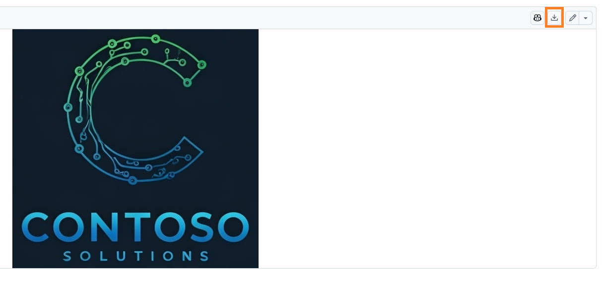

---
lab:
  title: 'Laboratório 0: Validar ambiente de laboratório'
  module: 'Module 0: Course Introduction'
---

# Laboratório de Prática 0 – Validar o ambiente de laboratório

> **IMPORTANTE:** Este laboratório fornece um locatário do Microsoft 365 e licenças para os aplicativos do Power Platform que você usará neste curso. Você receberá um único locatário para os laboratórios de prática neste curso. As configurações e as ações que você executa dentro desse locatário não podem ser revertidas ou redefinidas, mas a máquina virtual que você recebe é redefinida sempre que você fecha a sessão do laboratório. Lembre-se de que o Microsoft 365 e o Power Platform estão evoluindo o tempo todo. As instruções neste documento podem divergir do que você vivencia em seu locatário real. Também é possível experimentar um atraso de vários minutos antes que a máquina virtual tenha conectividade de rede para iniciar os laboratórios.

## Locatários do WWL – Termos de uso

Se você estiver recebendo um locatário como parte de uma entrega de treinamento com instrutor, observe que o locatário é disponibilizado com a finalidade de dar suporte aos laboratórios práticos no treinamento com instrutor.

Os locatários não devem ser compartilhados ou usados para fins fora dos laboratórios práticos. O locatário usado neste curso é um locatário de avaliação e não pode ser usado ou acessado após o fim da aula e não está qualificado para extensão.

Os locatários não podem ser convertidos em uma assinatura paga. Os locatários obtidos como parte deste curso permanecem a propriedade da Microsoft Corporation e reservamos o direito de obter acesso e a qualquer momento.

## Exercício 1: Acessar a Microsoft Power Platform

Neste exercício, você verificará se pode acessar o Power Apps.

### Tarefa 1.1 – Entrar no Power Apps

1. Verifique se você tem suas **credenciais do Microsoft 365** do Authorized Lab Host disponíveis. As credenciais estarão na guia **Recursos**.

1. Em uma nova guia do navegador, navegue até `https://powerapps.microsoft.com`

1. Selecione **Entrar**.

1. Insira o endereço de email fornecido pelo host de laboratório autorizado.

1. Selecione **Avançar**.

1. Digite a senha fornecida pelo host de laboratório autorizado.

1. Selecione **Entrar**.

1. Opcionalmente, selecione **Sim** para permanecer conectado.

1. Se solicitado a **Entrar no Microsoft Edge**, selecione **Não, obrigado**.

1. Se forem solicitadas informações de contato, deixe o País/região como o valor padrão, insira `0123456789` como Número de telefone e selecione **Enviar**.

1. No canto superior direito da tela, verifique se o **Ambiente** está definido como **Dev One**. É aqui que você vai trabalhar durante todo este laboratório. Se não estiver, selecione o ambiente **Dev One**.

    

1. Feche o painel **Selecionar ambiente**.

### Tarefa 1.2 — Atualizar navegador

A aplicação das atualizações mais recentes ao navegador evita problemas no próximo laboratório ao criar aplicativos.

1. Abra o navegador **Microsoft Edge**.

1. Selecione os **Comandos (...)** no canto superior direito do navegador, selecione **Ajuda e comentários** e selecione **Sobre o Microsoft Edge**.

1. Aplique as atualizações e reinicie o navegador, se necessário.

## Exercício 2: Baixar imagens

1. Abra uma janela do navegador em seu locatário e insira https://github.com/MicrosoftLearning/PL-900-Microsoft-Power-Platform-Fundamentals/tree/master/Allfiles.
1. Você verá as imagens na captura de tela.

    

1. Abra cada imagem separadamente e baixe selecionando o ícone **Baixar**.

    
