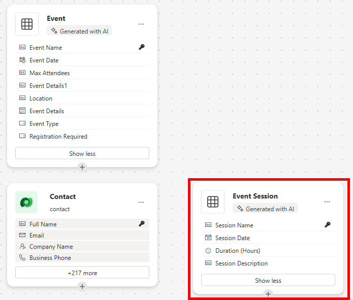
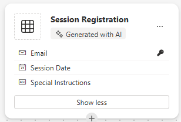
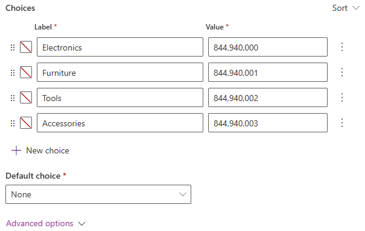

---
lab:
  title: 'Laboratório 2: Criar um modelo de dados'
  learning path: 'Learning Path: Manage the Microsoft Power Platform environment'
  module: 'Module 1: Describe Microsoft Dataverse'
---

## Objetivo de aprendizado

Neste exercício, os alunos usarão o Copilot para criar um modelo de dados. Você fornecerá uma descrição do tipo de tabelas que deseja criar e usará o designer para fazer alterações conforme necessário, por exemplo, adicionar colunas adicionais.

Após a conclusão bem-sucedida deste laboratório, você poderá:

- Usar o Copilot para ajudar na criação de um modelo de dados.
- Adicionar e editar colunas a tabelas.

### Cenário

A Contoso Consulting é uma organização de serviços profissionais especializada em serviços de consultoria de TI e IA. Ao longo do ano, eles promovem muitos eventos diferentes para seus clientes. Alguns deles são eventos no estilo de feiras em que muitos parceiros participam e dão detalhes sobre novos produtos, tendências de mercado e serviços. Outros ocorrem ao longo do ano e são webinars rápidos usados para fornecer detalhes sobre produtos individuais.

A Contoso gostaria de usar o Power Platform para criar uma solução de gerenciamento de eventos que possa ser usada para gerenciar os diferentes eventos que promovem ao longo do ano. Além disso, a Contoso está procurando criar alguns aplicativos para dar suporte ao programa de Retirada de equipamentos por funcionários. 

Neste exercício, você criará um modelo de dados que será usado para armazenar os diferentes tipos de eventos, registros de eventos e outros dados necessários para que a Contoso gerencie efetivamente seus eventos. Você também criará uma tabela de equipamentos que será usada em seus outros aplicativos.  

### Detalhes do laboratório

Antes de iniciar este exercício, é recomendável ter concluído:

- **Laboratório 1 – Criar uma solução**

> **Importante:** Este laboratório usa IA para criar os componentes. Como os resultados da IA podem variar, é importante observar que os seus resultados podem ser diferentes (mas semelhantes) do que é definido no laboratório. Os conceitos básicos descritos no laboratório serão os mesmos, independentemente do que foi criado ou de como foi nomeado. Se as tabelas e colunas não corresponderem exatamente, talvez seja necessário ajustar-se ao que for criado para você.

### Duração do laboratório

O tempo estimado para concluir este exercício é de **30 a 45**minutos.

> **Observação:** No laboratório anterior, criamos uma solução de gerenciamento de eventos e a definimos como a solução preferencial neste ambiente. Por isso, não precisamos ir diretamente para a solução para criar nosso modelo de dados. Os itens que criamos serão adicionados automaticamente à solução.

## Tarefa 1: Criar um modelo de dados

Atualmente, a Contoso armazena informações de contato de doadores em sua instância do Dataverse. Eles gostariam de usar o Dataverse para acompanhar os subsídios que estão solicitando e as doações que estão recebendo. Você precisa criar as tabelas necessárias para dar suporte às necessidades futuras do aplicativo da Contoso.

1.  Se necessário, abra um navegador da Web e navegue até o portal do criador do [Power Apps](https://make.powerapps.com/) e entre usando suas credenciais de conta Microsoft.
1.  Na tela inicial do Power Pages, usando a navegação à esquerda, selecione **Tabelas**.
1.  Em **Tabelas**, selecione **Introdução ao Copilot**.
1.  Na tela **Descreva as tabelas que você deseja que o Copilot crie**, insira: “*Criar uma tabela para gerenciar eventos. A tabela deve identificar o nome do evento, os dados do evento, o local, o número máximo de participantes e os detalhes do evento.”*
1.  Ao lado do botão **Gerar**, selecione **Configurações da Tabela** e configure da seguinte maneira:
    - **Opções de Tabela:** Uma tabela
    - **NÃO** inclua relações.

    

1.  Selecione o botão **Gerar**.

    > **Importante:** O Copilot só deve criar **UMA** tabela chamada **Eventos**. Se mais tiverem sido criadas, você precisará **EXCLUIR** informando ao Copilot o nome da tabela a ser excluída. **Deixar de remover as tabelas extras afetará a próxima etapa.**

    

**Editar o modelo de dados com o Copilot**

Agora que criamos a tabela, vamos adicionar algumas colunas adicionais a ela. Começaremos adicionando uma coluna de tipo de evento. Além disso, os Contatos participarão de nossos eventos. Queremos adicionar a tabela de Contato existente ao modelo de dados e associá-la aos Registros de Eventos posteriormente.

7.  No campo **O que você gostaria de fazer em seguida**, insira: *`Add a choice column named Event Type to Event table.`*
1.  Adicione outra coluna inserindo o seguinte texto: *`Add a choice column named Registration Required to Event table.`*

    

    > **Importante:** a tabela de eventos não precisa corresponder exatamente à imagem acima, mas deve ter pelo menos as seguintes colunas:
    - Nome do evento
    - Data do Evento
    - Máximo de Participantes
    - Localidade
    - Tipo de evento
    - Registro Necessário.

    Se você não tiver todas as colunas mencionadas acima, use o Copilot para adicioná-las ao modelo de dados.  

    Em seguida, vamos adicionar a tabela **Contato** ao modelo de dados.

1.  Na **Barra de comandos** na parte superior, selecione **+ Tabela existente**.
1.  No campo **Pesquisar**, insira **Contato** e escolha **Adicionar selecionado**.

    Dependendo do tipo de evento, pode haver uma ou mais sessões. Para gerenciar as diferentes sessões, precisamos definir o que é a sessão e o evento ao qual ela está associada. Em seguida, usaremos o Copilot para criar uma tabela de Sessões de Eventos.

1.  No campo **O que você gostaria de fazer em seguida**, insira: *`Add a new table called Event Session. `*

    O Copilot provavelmente criará duas tabelas, Sessão de Evento e Palestrante do Evento. Como nossos Contatos serão palestrantes, removeremos a tabela Palestrante do Evento.

1.  Se necessário, no campo **O que você gostaria de fazer em seguida**, insira: *`Remove the Event Speaker table.`*
1.  No Copilot, digite o seguinte texto: *`Add a new text column to the Event Session table called Session Description.`*

    

    Em seguida, adicionaremos uma última tabela chamada **Registros de Sessão**. Esta tabela será usada para gerenciar os indivíduos que se registram para sessões específicas.

1.  No Copilot, digite o seguinte texto: *`Add a new table called Session Registrations.`*

    O Copilot provavelmente criará duas tabelas, Registro de Sessão, Sessão ou Participante (ou outra coisa). Como nossos Contatos podem ser participantes, vamos remover a tabela Participante. Se outras tabelas (como Sessão ou outra coisa) que não o Registro de Sessão tiverem sido criadas, remova-as.

1.  Se necessário, no Copilot, digite o seguinte texto: *`Remove the Participant table.`*
    
    Às vezes, uma coluna Nome do Participante será adicionada à tabela de registro da sessão. Precisamos removê-la, pois isso pode causar problemas posteriormente quando tentarmos salvar o modelo de dados. (Vamos substituí-la por uma coluna de participante diferente mais tarde.)  

1.  Se necessário, no Copilot, digite o seguinte texto: *`Remove the Participant Name column from the Session Registration table.`*

1.  Se agora você tiver um campo Coluna Primária, insira o seguinte texto: *`Rename the Primary Column to Registration Name in Session Registration table.`*

1.  No Copilot, digite o seguinte texto: *`Add a text column to the Session registration table called Special Instructions.`*

    A tabela Registro de Sessão concluída deve ser semelhante à imagem abaixo:

    

    > **Importante** Embora a sua não precise corresponder exatamente, é importante que você não tenha uma coluna chamada Participante e que tenha pelo menos o seguinte:
    - Nome de Registro
    - Data da Sessão
    - Instruções especiais

    Agora vamos criar relações entre nossas tabelas. Como os registros de Contato podem ser palestrantes nas sessões, vamos criar uma relação entre as tabelas Contato e Sessão de Evento.

1.  Na Barra de comandos, selecione **Criar relações**.
1.  Configure a relação da seguinte maneira:
    - **Tipo de Relacionamento:** Um para muitos
    - **Um:** Contato
    - **Muitos:** Sessão de Evento
    - **Nome de exibição**: `Speaker`
1.  Selecione **Concluído**.

    

    Como os contatos podem ser registrados para sessões em sessões, vamos criar uma relação entre as tabelas Contato e Registro de Sessão.

1.  Na **Barra de comandos**, selecione **Criar relações**.
1.  Configure a relação da seguinte maneira:
    - **Tipo de Relacionamento:** Um para muitos
    - **Um:** Contato
    - **Muitos:** Registro de Sessão
    - **Nome de exibição**: `Participant`

    

1.  Selecione **Concluído**.

    Um único evento pode ter várias sessões associadas a ele, portanto, vamos criar uma relação entre as tabelas Evento e Sessão de Evento.

1.  Na **Barra de comandos**, selecione **Criar relações**.
1.  Configure a relação da seguinte maneira:
    - **Tipo de Relacionamento:** Um para muitos
    - **Um:** Evento
    - **Muitos:** Sessão de Evento
    - **Nome de exibição**: `Event`

    

1. Selecione **Concluído**.

    Por fim, os participantes se registram em Sessões de Evento, portanto, precisaremos criar uma relação entre as tabelas Sessões de Evento e Registros de Sessão.

1.  Na **Barra de comandos**, selecione **Criar relações**.
1.  Configure a relação da seguinte maneira:
    - **Tipo de Relacionamento:** Um para muitos
    - **Um:** Sessão de Evento
    - **Muitos:** Registros de Sessão
    - **Nome de exibição**: `Event Session`

    

1.  Selecione **Concluído**.

    O modelo de dados recém-criado deve ficar parecido com esta imagem:

    

1.  Selecione **Salvar e sair.**

## Tarefa 2: Editar tabelas e colunas diretamente

O Copilot é uma maneira maravilhosa de criar tabelas e colunas muito rapidamente. No entanto, pode haver momentos em que você precisa fazer modificações diretamente em tabelas e colunas. Por exemplo, nesta tarefa, vamos atualizar algumas colunas existentes, bem como acompanhar quantos participantes estão registrados para uma sessão específica.

1.  Se necessário, abra um navegador da Web e navegue até o portal do criador do [Power Apps](https://make.powerapps.com/) e entre usando suas credenciais de conta Microsoft.
1.  Na navegação à esquerda, selecione **Tabelas**.
1.  No campo de **Pesquisa**, insira **Evento**.
1.  Abra a tabela **Evento**.
1.  No cabeçalho **Esquema**, selecione **Colunas**.
1.  Localize e abra a coluna **Tipo de Evento**.
1.  Substitua os Rótulos pelo seguinte:
    - Conferência
    - Feira de Negócios
    - Webinar
    - Almoço e aprendizado
    - Inicializar
1.  Defina **Escolha padrão** como **Nenhuma**.

    

1.  Selecione o botão **Salvar**. (*Se a coluna não for salva na primeira vez, tente novamente.*)

    Em seguida, adicionaremos uma nova coluna à tabela **Sessão de Evento** para acompanhar o número total de registros de sessão.

1.  Usando o painel de navegação à esquerda, selecione **Tabelas** para sair da tabela **Evento**.
1.  No campo de **Pesquisa**, insira **Evento**.
1.  Abra a tabela **Sessão de Evento**.
1.  No cabeçalho **Esquema**, selecione **Colunas**.
1.  Na barra de comandos, selecione o botão **Nova Coluna**.
1.  Configure a nova coluna da seguinte maneira:
    - **Nome de exibição**: `Total Registrations`
    - **Tipo de dados:** Número inteiro
    - **Comportamento**: Rollup

    

1.  Selecione **Salvar e editar**.

    > **Importante:** Se o bloqueador de pop-ups estiver ativado, talvez seja necessário desativá-lo para que o campo de rollup seja exibido.

1.  Configure a coluna de Rollup da seguinte maneira:
    - Em **Entidade Relacionada**, selecione **adicionar entidade relacionada**.
    - Escolha a tabela **Registro de Sessão**.
    - Selecione o botão **Salvar alterações** (*marca de seleção*)
    - Em **Agregação**, selecione **Adicionar agregação**.
    - Em **Função de agregação**, escolha **Contagem**.
    - Para o campo **Entidade relacionada agregada**, selecione **Registro de Sessão**.
    - Selecione o botão **Salvar alterações*** (marca de seleção)*

    

1.  Selecione o botão **Salvar e Fechar (Save and Close)** .

    Você criou com êxito o modelo de dados que será usado para dar suporte ao aplicativo de gerenciamento de eventos. 

## Tarefa 3: Criar uma tabela de equipamentos

Além de gerenciar eventos, a Contoso tem um programa de retirada para funcionários.  Em seguida, criaremos a tabela para armazenar o equipamento. 
1.  Na navegação à esquerda, selecione **Tabelas**.
1.  Em **Tabelas**, selecione **Introdução ao Copilot**.
1.  Na tela **Descreva as tabelas que você deseja que o Copilot crie**, insira: *`Create a table for checking out equipment. The table should include the Equipment Name, Due Date, and Item number.`*
1.  Ao lado do botão **Gerar**, selecione **Configurações da Tabela** e configure da seguinte maneira:
    - **Opções de Tabela:** Uma tabela
    - **NÃO** inclua relações.

    

1. Selecione o botão **Gerar**.

    > **Importante:** o Copilot só deve criar uma tabela chamada **Retirada de Equipamento**. Se mais tiverem sido criadas, você precisará excluí-las informando ao Copilot o nome da tabela a ser excluída.

**Editar o modelo de dados com o Copilot**

Agora que criamos a tabela, vamos adicionar algumas colunas adicionais a ela. Começaremos adicionando uma coluna de tipo de evento. Além disso, os Contatos participarão de nossos eventos. Queremos adicionar a tabela de Contato existente ao modelo de dados e associá-la aos Registros de Eventos posteriormente.

6.  No campo **O que você gostaria de fazer em seguida**, insira: *`Rename the table to Equipment.`*
1.  No campo **O que você gostaria de fazer em seguida**, insira: *`Add a choice column named Equipment type.`*
1.  Adicione outra coluna inserindo o seguinte texto: *`Add a text column named Category.`*
1.  Adicione outra coluna inserindo o seguinte texto: *`Add a text column named Status.`*

    Sua tabela concluída deve ser semelhante à imagem abaixo:

    

1.  Se a tabela incluir colunas extras, remova essas colunas inserindo *`Delete the [column name] column.`*
1.  Quando a tabela corresponder à imagem, selecione **Salvar e sair**.

## Tarefa 4: Modificar a tabela Equipamento diretamente

1.  Se necessário, abra um navegador da Web e navegue até o portal do criador do Power Apps e entre usando suas credenciais de conta Microsoft.
1.  Na navegação à esquerda, selecione **Tabelas**.
1.  No campo de **Pesquisa**, insira **Equipamento**.
1.  Abra a tabela **Equipamento**.
1.  No cabeçalho **Esquema**, selecione **Colunas**.
1.  Localize e abra a coluna **Tipo de Equipamento**.
1.  Se necessário, substitua os Rótulos pelo seguinte:
    - Eletrônicos
    - Móveis
    - Ferramentas
    - Acessórios
1.  Defina **Escolha padrão** como **Nenhuma**.

    

1.  Selecione o botão Salvar. (Se a coluna não for salva na primeira vez, tente novamente.)

Parabéns, você criou com êxito um modelo de dados no Microsoft Dataverse.

