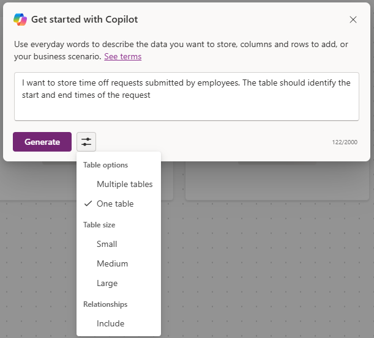
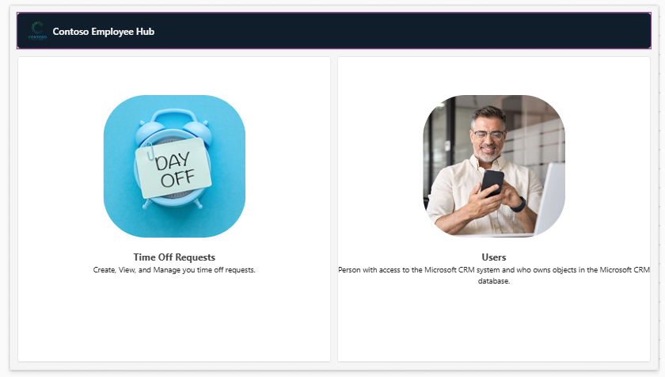
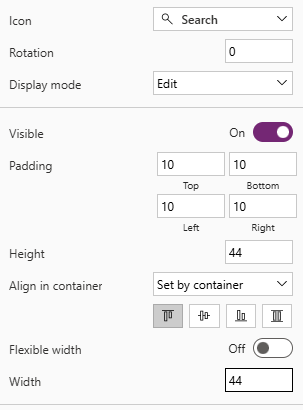
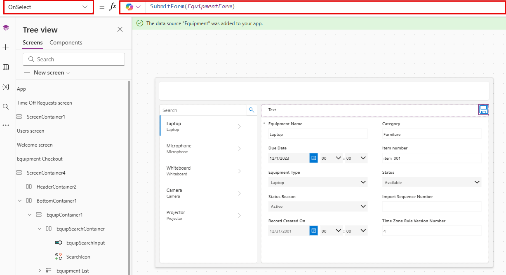

---
lab:
  title: '‘Laboratório 4: Criar um aplicativo de tela'
  learning path: 'Learning Path: Demonstrate the capabilities of Microsoft Power Apps'
  module: 'Module 2: Build a canvas app'
---
## Objetivo de aprendizado

Neste exercício, você usará o Copilot para criar um aplicativo de tela que os funcionários podem usar para solicitar e gerenciar solicitações de folga e retirada de equipamentos. Após o aplicativo ser criado, você usará o Copilot e o designer do Power Apps para alterá-lo.

Após a conclusão bem-sucedida deste laboratório, você poderá:

- Usar o Copilot para ajudar na criação de um modelo de dados para dar suporte ao seu aplicativo.
- Modificar um aplicativo de tela.

### Cenário

A Contoso Consulting é uma organização de serviços profissionais especializada em serviços de consultoria de TI e IA. Eles querem criar um aplicativo de folga que os funcionários possam usar para solicitar folgas.

### Detalhes do laboratório

Antes de iniciar este exercício, você precisa ter concluído o seguinte laboratório:

- **Laboratório 2 – Criar um modelo de dados**

> **Importante** Este laboratório usa IA para criar os componentes. Como os resultados da IA podem variar, é importante observar que os seus resultados podem ser diferentes (mas semelhantes) do que é definido no laboratório. Os conceitos básicos descritos no laboratório serão os mesmos, independentemente do que foi criado ou de como foi nomeado. Se as tabelas e colunas não corresponderem exatamente, talvez seja necessário ajustar-se ao que for criado para você.*

O tempo estimado para concluir este exercício é de **60 a 75**minutos.

## Tarefa 1: Entrar no Power Apps e explorar a interface

1.  Abra um navegador da Web e acesse o portal do criador do [Power Apps](https://make.powerapps.com/).
2.  Usando a navegação à esquerda, selecione **Criar**.
3.  Em **Criar seus aplicativos**, escolha **Começar com o Copilot**.
4.  Na tela **Descreva as tabelas que você deseja que o Copilot crie**, digite: “Quero armazenar solicitações de folga enviadas por funcionários. A tabela deve identificar os horários de início e término da solicitação.”
5.  Selecione o botão **Opções da tabela**. No menu exibido, selecione **Uma Tabela**.

6.  Selecione o botão **Gerar**.

O Copilot deve ter criado uma tabela **Solicitação de Folga**. Em seguida, adicionaremos mais colunas à tabela.

7.  No painel do **Copilot**, insira: “*Adicione uma coluna de escolha chamada Motivo da Folga.”*
8.  No painel do **Copilot**, adicione individualmente os seguintes prompts:
    - “*Adicionar uma coluna de escolha chamada Tipo de Folga.”*
    - “*Adicionar uma coluna de Data chamada Data de Envio.”*
    - “*Adicionar uma coluna de escolha à tabela de solicitação de Folga chamada Status de Aprovação.”*
    - “*Adicionar uma coluna de texto de várias linhas chamada Detalhes da Solicitação.”*

    Sua tabela de folga deve ser semelhante à imagem:

Em seguida, vamos adicionar a tabela de usuário ao modelo de dados para que possamos associar solicitações de folga a usuários específicos.

9.  Na **Barra de comandos**, selecione **+ Tabela existente**.
10.  Alterne de **Recomendado** para **Todas as Tabelas**.
11.  No campo **Pesquisar**, insira **Usuário**.
12.  Selecione a tabela **Usuário** e clique no botão **Adicionar Selecionado**.
13.  Na **Barra de comandos**, selecione **Criar relações**.
14.  Configure a relação da seguinte maneira:

-   **Um:** Usuário
-   **Muitos:** Solicitação de Folga
-   **Nome de Exibição:** Funcionário Solicitante
  
15.  Selecione **Concluído**.

O modelo de dados concluído deve ficar parecido com esta imagem:

16.  Selecione o botão **Salvar e abrir o aplicativo**.

> [!NOTE]
> Pode demorar alguns minutos para que o aplicativo seja criado.

## Tarefa 2: Personalizar o novo aplicativo

Agora que o aplicativo foi criado, faremos algumas modificações para atender melhor às nossas necessidades. Vamos começar fazendo algumas modificações na tela de boas-vindas.

1.  Com o novo aplicativo aberto, selecione o espaço reservado **Imagem** acima do texto **Solicitações de Folga** **.**
2.  No menu que aparecerá, selecione **Editar** \> **Carregar**.
3.  Escolha a imagem **Folga** na pasta de arquivos de classe e selecione **Abrir**.
4.  Em seguida, selecione o espaço reservado **Imagem** acima de **Usuários**.
5.  No menu que aparecerá, selecione **Editar** \> **Carregar**.
6.  Escolha a imagem **Funcionário** na pasta de arquivos de classe e selecione **Abrir**.

Em seguida, vamos ajustar o tamanho das imagens para facilitar a leitura dos usuários. Além disso, vamos ajustar o texto exibido para cada item.

7.  Na **Barra de comandos**, selecione o botão **Propriedades**. (*Localizado à direita do botão Edição.*)
8.  Selecione a imagem **Folga** que você adicionou anteriormente.
9.  No painel **Propriedades**, configure a imagem da seguinte maneira:
    
    -   **Posição da Imagem:** Preencher
    -   **Largura:** 300
    -   **Altura:** 300
      
11.  Repita a etapa anterior para definir a **Altura** e a **Largura** da imagem **Funcionário** para **300** x **300**.
12.  Selecione o texto abaixo de **Solicitações de Folga**.
13.  No painel **Propriedades**, selecione o campo **Texto** e altere o texto para: “*Crie, visualize e gerencie solicitações de folga.”*
14.  Selecione o texto **Tela de Boas-vindas** no **Cabeçalho**.
15.  No painel **Propriedades** à direita, selecione o campo **Logotipo**.
16.  No menu exibido, selecione **Carregar**.
17. Selecione o **Logotipo da Contoso** em seus arquivos de classe e selecione **Abrir**.
18. No painel **Propriedades**, no grupo de temas e **Estilo**, selecione o ícone de cor de **Preenchimento**.
19. Selecione a guia **Personalizado**
20. Altere a cor **Hex** para: **101E2B**
21. Verifique se você ainda tem o **Cabeçalho** selecionado e altere o **Título** para **Hub de Funcionários da Contoso**.
22. Na **Barra de comandos**, selecione o botão **Salvar** e salve o aplicativo.
23. Na tela **Salvar**, defina o **Nome** como **Hub de Funcionários da Contoso** e selecione **Salvar.**

Seu aplicativo será semelhante à imagem.

## Tarefa 3: Adicionar uma nova tela ao aplicativo.

Enquanto você está criando o aplicativo, um de seus gerentes pergunta se os funcionários também podem usar esse aplicativo para retirar equipamentos. A Contoso já está armazenando informações de retirada de equipamentos no Dataverse, portanto, é apenas uma questão de disponibilizar as informações no aplicativo.

1.  Com o aplicativo ainda aberto, expanda o painel do **Copilot** (se necessário). No Copilot, digite o seguinte: “*Adicionar uma nova tela chamada Retirada de Equipamento.”*
2.  Selecione **Enviar**.
3.  Selecione o botão **Manter** para aceitar a nova tela.
4.  Uma tela chamada **Retirada de Equipamento** é adicionada ao seu aplicativo.
5.  Na tela **Retirada de Equipamento**, clique em **Com o layout** e escolha o layout de **Barra lateral**.
6.  Expanda os diferentes contêineres até que **SideBarContainer** esteja visível.

7.  Clique com o botão direito do mouse em **SidebarContainer** e renomeie como **EquipContainer1**.
8.  Com o contêiner **EquipContainer1** selecionado, clique no botão ** Abrir Menu de Inserção**.
9.  Na janela **Pesquisar**, insira **Galeria** e selecione **Galeria vertical**.
10.  Quando você for solicitado a fornecer uma fonte de dados no campo **Pesquisar**, insira **Equipamentos** e selecione a tabela **Equipamento*s*.
11. Em **Modo de Exibição de Árvore** no lado esquerdo da tela, selecione o controle **Gallery1** que você acabou de adicionar.
12. Clique com o botão direito do mouse no nome da Galeria, escolha **Renomear** e renomeie para **Lista de Equipamentos**.
13. Passe o mouse sobre a galeria **Lista de Equipamentos** na barra de ferramentas que aparece acima da galeria e selecione **Layout**.
14. Selecione a opção **Layout de título e subtítulo**.
15. Com a galeria **Lista de Equipamentos** selecionada, no painel **Propriedades**, configure da seguinte maneira:

    -   **Largura:** 360
    -   **Altura flexível:** Ativado
    -   **Altura mínima:** 287

Em seguida, adicionaremos um contêiner adicional ao contêiner **EquipmentContiner1** para armazenar um controle de pesquisa que usaremos para filtrar o conteúdo da galeria **Lista de Equipamentos**.

16.  No modo de exibição **Árvore**, selecione **EquipContainer1**.
17.  Passe o mouse sobre o contêiner e selecione o ícone do **Copilot**.
18.  Digite o texto a seguir: “*Inserir um contêiner horizontal.*”

19.  Selecione o botão **Manter**.
20.  Um novo contêiner será adicionado à parte inferior do contêiner **EquipContainer1**.
21.  No **Modo de Exibição de Árvore**, clique, segure e arraste o novo contêiner e coloque-o acima da galeria **Lista de Equipamentos**.
22.  Renomeie o contêiner como **EquipSearchContainer**.
23.  Com a galeria **EquipSearchContainer** selecionada, no painel **Propriedades**, configure da seguinte maneira:
    
 -   **Largura mínima:** 0
 -   **Altura flexível:** Desativado
 -   **Altura:** 44
   
24.  Com **EquipSearchContainer** selecionado, selecione o botão **Abrir Menu de Inserção**.
25. No campo **Pesquisar**, insira **Texto** e selecione **Entrada de Texto**.
26. Renomeie o campo **Entrada de Texto** como **EquipSearchInput**.
27. Com **EquipSearchInput** selecionado, no painel **Propriedades**, configure da seguinte maneira:

    -   **Padrão:** Em branco (nada)
    -   **Texto da dica:** Pesquisar
    -   **Fonte:** Open Sans
    -   **Tamanho da fonte:** 14
    -   **Preenchimento** (os valores abaixo podem já estar lá.)
        -   **Superior:** 5
        -   **Inferior:** 5
        -   **Esquerda:** 12
        -   **Direita:** 5
    -   **Altura:** 44
    -   **Largura flexível:** Ativado
    -   **Largura mínima:** 0

        

28. No **Modo de Exibição de Árvore**, selecione o **EquipSearchContainer.**
29. Passe o mouse sobre o contêiner, selecione o ícone do **Copilot** e insira *“Adicionar um Ícone de Pesquisa.”*
30. Selecione **Manter**.

> **Observação:** se o Coplot adicionar o ícone errado, remova-o e insira a lupa manualmente.

31. Com o ícone de **Pesquisa** selecionado, no painel **Propriedades**, configure o controle da seguinte maneira:

    -   **Preenchimento**
        -   **Superior:** 10
        -   **Inferior:** 10
        -   **Esquerda:** 10
        -   **Direita:** 10
    -   **Altura:** 44
    -   **Largura:** 44

32. Usando o **Modo de exibição árvore** à esquerda, selecione **EquipSearchContainer**.
33. No painel **Propriedades**, configure o contêiner da seguinte maneira:

    -   **Largura mínima:** 0
    -   **Altura:** 44

Por fim, vamos configurar a **Lista de Equipamentos ** para preencher seus dados com base no texto inserido no campo de controle de pesquisa.

34.  Selecione a galeria **Lista de Equipamentos** que criamos anteriormente.
35.  Na propriedade **Itens**, insira a seguinte fórmula: Search([@'Equipments'], *EquipSearchInput*.Text, 'Equipment Name',Category)

36. Na **Barra de comandos**, selecione o botão **Salvar** e salve seu aplicativo.

> **Importante:** se você copiou e associou a fórmula na barra de fórmulas, é possível que '' esteja incorreto para o Nome do Equipamento e o Equipamento. Se você estiver recebendo um erro de fórmula, tente removê-las e inseri-las novamente.

## Tarefa 4: Crie um contêiner para exibir operações de registro.

Quando um usuário seleciona um registro na lista Equipamentos, queremos abrir o registro em outro contêiner para permitir que ele edite o registro selecionado.

1.  Selecione o **MainContainer** e renomeie-o como **DetailsContainer**.
2.  No **DetailsContainer**, selecione o botão **Inserir**.
3.  No campo **Pesquisar**, insira **Contêiner** e escolha **Contêiner Vertical**.
4.  Clique com o botão direito do mouse e **Renomeie** o contêiner para **RecordDetails**.
5.  No contêiner **RecordDetails**, selecione o botão **Inserir**.
6.  No menu **Inserir**, **Editar formulário**.
7.  Na tela selecionar fonte de dados, selecione **Equipamentos**. *(Pode levar até 30 segundos para que os dados sejam preenchidos.)*
8.  Clique com o botão direito do mouse no formulário que você acabou de adicionar e **Renomeie** como **EquipmentForm**.
9.  No painel **Propriedades**, selecione a guia **Avançado** e defina a propriedade **Item** como: *'Equipment List'*.Selected. *(Isso preencherá o formulário com o registro selecionado no momento.)*
10. Selecione a guia **Exibir** e configure o formulário da seguinte maneira:

    -   **Colunas:** 2
    -   **Modo padrão:** Editar

Agora, vamos adicionar outro contêiner que será usado para controlar as operações no formulário.

11.  Verifique se você tem **DetailsContainer** selecionado.
12.  Selecione o ícone do **Copilot** exibido. Digite o seguinte: “*Inserir um contêiner horizontal.*”
13.  Selecione **Manter**.
14.  Clique com o botão direito do mouse no contêiner e **Renomeie** como **SelectedRecord1**
15.  Usando a exibição de **Árvore**, mova o contêiner **SelectedRecord1** acima do contêiner **RecordDetails**.
16.  Configure o contêiner **SelectedRecord1** da seguinte maneira:
    
-   **Largura mínima:** 250
-   **Altura flexível:** Desativado
-   **Height**: 50
    
18.  Com o contêiner **SelectedRecord1** selecionado, selecione o botão **Inserir**.
19.  Selecione **Rótulo de Texto**.
20.  Renomeie o rótulo para **SelectedRecordTitle**.
21. Configure o **SelectedRecordTitle** da seguinte maneira:

    1.  **Preenchimento**
        1.  **Superior:** 5
        2.  **Inferior:** 5
        3.  **Esquerda:** 30
        4.  **Altura:** 40
    2.  **Largura flexível:** Ativado
    3.  **Largura mínima:** 150
       
23. Selecione o contêiner **SecondRecord1**, selecione o botão **Inserir**.
24. No campo **Pesquisar**, insira **Salvar** e selecione o ícone **Salvar**.
25. Configure o botão **Salvar** da seguinte maneira:

    -   **Altura:** 40
    -   **Width**: 40
      
27. Selecione a propriedade **OnSelect** e insira a seguinte fórmula: SubmitForm(EquipmentForm).

## Tarefa 5: Modificar o cabeçalho na página

A última etapa da criação desta tela é preencher o contêiner do leitor com dados.

1.  Selecione **HeaderContainer** na parte superior do aplicativo.
2.  Selecione o botão **Inserir**.
3.  Selecione **Rótulo de texto**.
4.  Configure o controle **Rótulo de texto** da seguinte maneira:
   
    -   **Texto:** Retirada de Equipamento
    -   **Fonte:** Open Sans
    -   **Tamanho da Fonte:** 16
    -   **Peso da fonte:** Seminegrito
        -   **Preenchimento:** 16
        -   **Inferior:** 16
        -   **Esquerda:** 16
        -   **Direita:** 16
    -   **Altura:** 40
    -   **Largura flexível:** Ativado

        

6.  Selecione o **HeaderContainer**, escolha **Inserir** e selecione o ícone **Página Inicial**.
7.  Defina a propriedade **OnSelect** do botão de início como: Back()

## Tarefa 6: Concluir a configuração da tela de boas-vindas

Após a revisão, decidimos que não precisamos ter a capacidade de criar usuários neste aplicativo, portanto, vamos alterar a Tela de Boas-Vindas para permitir que você acesse a retirada de equipamentos.

7.  Usando o **Modo de Exibição de Árvore**, selecione a **Tela de boas-vindas**.
8.  Selecione a **Imagem** acima de **Usuários**.
9.  No menu que aparecerá, selecione **Editar** e escolha **Carregar**.
10.  Localize a imagem do **Equipamento** na pasta do aluno e escolha **Abrir**.
11.  Defina a propriedade **OnSelect** da imagem como: Navigate(*'Equipment Checkout'*)
12.  Selecione o texto **Usuários** e defina a propriedade **Texto** como **Equipamento**.
13.  Selecione o **Texto** abaixo de **Equipamento** e altere a propriedade **Texto** para: Retire equipamentos e edite reservas.

14. Clique no botão **Salvar** para salvar seu aplicativo.

## Tarefa 7: Testar o aplicativo

1.  Na **Barra de comandos**, selecione o botão **Reproduzir**.
2.  Selecione a imagem **Equipamento**.
3.  No campo de **Pesquisa**, insira **Eletrônico**. (*Observe como a lista é filtrada*)
4.  Selecione o registro **Laptop**.
5.  Altere a **Categoria** para **Móveis**.
6.  Selecione o botão **Salvar**.
7.  Observe como a categoria **Laptop** muda para **Móveis**.
8.  Selecione o botão **Início**.
9.  Selecione o **X roxo** para sair do modo de **Visualização**.

## Tarefa 8: Salvar e publicar o aplicativo

**Meta:** Salve e publique o aplicativo para torná-lo acessível em navegadores da Web, dispositivos móveis ou plataformas inseridas, como SharePoint ou Teams.

1.  No Power Apps Studio, selecione o botão **Salvar**.
2.  Selecione o botão **Publicar**.
3.  Selecione **Publicar esta versão.**
