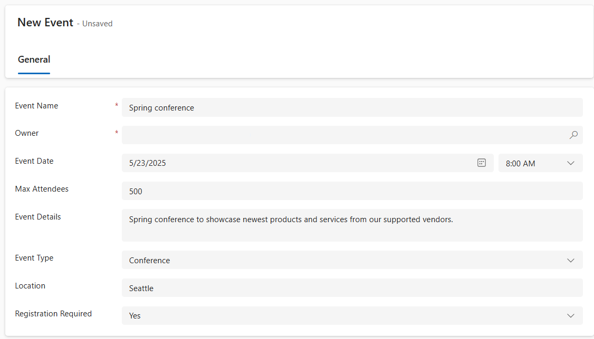

---
lab:
  title: 'Laboratório 5: Criar um aplicativo baseado em modelo'
  learning path: 'Learning Path: Demonstrate the capabilities of Microsoft Power Apps'
  module: 'Module 3: Build a model-driven app'
---
## Objetivo de aprendizado

Neste exercício, os alunos criarão um aplicativo baseado em modelo no Power Apps usando o Copilot. Você definirá o modelo de dados, modificará formulários e exibições e criará o aplicativo.

**Após a conclusão bem-sucedida deste laboratório, você poderá:**

-   Criar um aplicativo baseado em modelo.
-   Modificar formulários e exibições no aplicativo para melhor atender às suas necessidades.
-   Navegar por um aplicativo baseado em modelo.

### Cenário

A Contoso Consulting é uma organização de serviços profissionais especializada em serviços de consultoria de TI e IA. Ao longo do ano, eles promovem muitos eventos diferentes para seus clientes. Alguns deles são eventos no estilo de feiras em que muitos parceiros participam e dão detalhes sobre novos produtos, tendências de mercado e serviços. Outros ocorrem ao longo do ano e são webinars rápidos usados para fornecer detalhes sobre produtos individuais.

A Contoso gostaria de usar o Power Platform para criar uma solução de gerenciamento de eventos que possa ser usada para gerenciar os diferentes eventos que promovem ao longo do ano.

Neste exercício, você criará um aplicativo baseado em modelo para gerenciar os eventos da Contoso. O aplicativo baseado em modelo será baseado em um modelo de dados existente e incluirá Eventos, Sessões de Evento e registros de Sessão.

### Detalhes do laboratório:

Antes de iniciar este exercício, é recomendável ter concluído:

-   **Laboratório 1 – Criar uma solução**
-   **Laboratório 2 – Criar um modelo de dados**

O tempo estimado para concluir este exercício é de **20 a 30**minutos.

## Tarefa 1: Criar um modelo de dados para dar suporte ao seu aplicativo baseado em modelo

Atualmente, a Contoso armazena informações de contato em sua instância do Dataverse, portanto, eles gostariam de usar o Dataverse para acompanhar cursos e registros de curso. Você precisa criar as tabelas necessárias para dar suporte ao aplicativo e criar um aplicativo baseado em modelo com base nesse modelo de dados.

1.  Se necessário, abra um navegador da Web e navegue até o portal do criador do [Power Apps](https://make.powerapps.com/) e entre usando suas credenciais de conta Microsoft.
2.  Usando a navegação à esquerda, selecione **Soluções.**
3.  Abra a solução **Gerenciamento de Eventos** criada anteriormente.
4.  Na **Barra de comandos**, selecione **Novo** \> **Aplicativo** \> **Aplicativo baseado em modelo**.
5.  Selecione o botão **Criar**.
    -   **Nome:** Contoso Event Management
    -   **Descrição:** Usado para gerenciar eventos e sessões de eventos.
6.  Selecione o botão **Criar****.**
7.  Selecione o botão **Adicionar Página**, selecione **Tabela do Dataverse.**
8.  Escolha as seguintes tabelas:
    -   Contato
    -   Evento
    -   Sessão de Evento
    -   Registro de sessão
9.  Certifique-se que **Exibir na navegação** esteja selecionado.

10. Selecione o botão **Adicionar**.

> **Observação:** Às vezes, você será solicitado a entrar enquanto trabalha com o designer. Selecione o X para cancelar a tela de entrada.

## Tarefa 2: Editar o aplicativo baseado em modelo para atender às suas necessidades

Agora que o aplicativo foi criado, faremos algumas alterações na maneira como ele é apresentado. Queremos ter dois grupos distintos, pessoas e eventos. Queremos ter a tabela Contatos no grupo Pessoas e todas as tabelas de eventos no grupo Eventos.

1.  Em **Navegação** no lado esquerdo da tela, selecione **Novo Grupo**.
2.  No lado direito do aplicativo, expanda o painel **Propriedades**.
3.  Altere o **Título** de **Novo Grupo** para **Pessoas**.

    

4.  Selecione as **Reticências** no grupo **Pessoas**.
5.  Escolha **Novo grupo**.
6.  No painel **Propriedades**, altere o nome do grupo de **Novo grupo** para **Eventos**.
7.  Passe o mouse sobre **Exibição de Registros de Sessão** à esquerda, selecione as **reticências** e escolha **Mover para baixo** para mover **Registros de Sessões** para o grupo **Eventos**.
8.  Focalize a exibição **Sessões de Evento** à esquerda, selecione as **reticências** e escolha **Mover para baixo** para mover **Sessões de Evento** para o grupo **Eventos**.
9.  Focalize a **Exibição de eventos** à esquerda, selecione as **reticências** e escolha **Mover para baixo** para mover **Eventos** para o grupo **Eventos**.

Seu aplicativo deve ser semelhante à imagem:

## Tarefa 3: Editar os diferentes formulários e exibições em seu aplicativo baseado em modelo

O aplicativo de unidade de modelo usa formulários e exibições para apresentar dados aos usuários na interface do usuário. Faremos algumas alterações nesses itens.

1.  Se necessário, verifique se o aplicativo **Gerenciamento de Evento da Contoso** está aberto no designer.
2.  No lado esquerdo da tela, no grupo **Pessoas**, passe o mouse sobre **Formulário de contatos** e selecione **Editar**.

    Se for solicitado a salvar as alterações, selecione **Salvar e continuar**.

3.  Em **Colunas da Tabela** à esquerda, selecione **Nova coluna de tabela**.
4.  Configure a nova tabela da seguinte maneira:
    -   **Nome de exibição:** Tipo de Contato
    -   **Tipo de dados:** Escolha
    -   **Sincronizar com a opção global:** Não
5.  Defina o **Rótulo** da primeira opção para **Palestrante.**
6.  Selecione **+ Nova Escolha** e defina o rótulo como **Participante.**
7.  Selecione **+ Nova Escolha** e defina o rótulo como **Equipe de suporte.**

8.  Selecione o botão **Salvar**.
9.  Usando o mouse, selecione o texto **Novo Contato** para selecionar o cabeçalho do formulário. *(Um retângulo roxo deve aparecer ao redor do cabeçalho)*
10. Em **Colunas da tabela**, no campo **Pesquisar**, insira **Contato**.
11. Selecione a coluna de tabela **Tipo de Contato** que você acabou de criar.
12. O **Tipo de Contato** agora deve aparecer **Cabeçalho**.

13. Na **Barra de comandos** do formulário, selecione o botão **Salvar e Publicar**.
14. Selecione o botão **Seta para trás** para retornar ao designer do aplicativo baseado em modelo
15. Em **Navegação** à esquerda, passe o mouse sobre **Exibição de contatos** e selecione o ícone **Editar**. (Se solicitado a salvar, selecione **Salvar e continuar**.)
16. Selecione **+ Exibir Coluna**.
17. Pesquise e adicione a coluna **Tipo de Contato** à exibição.
18. Selecione o botão **Salvar e Fechar**.
19. Selecione o botão **Seta para trás** para retornar ao designer do aplicativo baseado em modelo.

Em seguida, faremos as alterações necessárias nos formulários restantes.

20.  Em **Navegação**, selecione **Exibição de Eventos**
    
Observe que pode haver uma coluna **EventDetails1**. Nesse caso, vamos removê-la da exibição. *(se você não a tiver, poderá pular para a **Tarefa 4: Salvar e publicar**)*

21.  Passe o mouse sobre a **Exibição de eventos** e selecione o botão **Editar**.

Se solicitado a **Salvar** as alterações, selecione **Salvar e continuar**.

22.  Na **Exibição**, selecione a seta ao lado de **EventDetails1** e, no menu exibido, selecione **Remover**.

23.  Selecione o botão **Salvar e Fechar**.
24.  Selecione o botão **Seta para trás** para voltar ao designer do aplicativo.
25.  Em **Navegação**, passe o mouse sobre o **formulário** **Eventos** e selecione **Editar**.

Se solicitado a salvar as alterações, selecione **Salvar e continuar**.

26.  Selecione o campo **Detalhes do Evento1** e pressione a tecla **Delete** no teclado.

Seu formulário deve ser semelhante à imagem:

Se não corresponder exatamente, tudo bem, desde que todos os campos na imagem estejam lá.  

27.  Selecione o botão **Salvar e publicar**.
28.  Selecione o botão **Seta para trás** para voltar ao designer do aplicativo.

## Tarefa 4: Salvar e publicar (se você não tiver o campo EventDetail1 no formulário, continue aqui.)

1.  Na **Barra de comandos** do aplicativo, selecione o botão **Salvar e Publicar**.
2.  Selecione o botão **Voltar** para voltar à solução **Gerenciamento de Eventos**.
3.  Selecione a seta **Voltar às soluções** para retornar ao portal do criador do **Power Apps**.
4.  Selecione a seta **Voltar** para voltar à tela principal do **Power Apps**.

## Tarefa 5: Testar o novo aplicativo

Agora que seu aplicativo baseado em modelo foi criado, vamos testar sua funcionalidade.

Primeiro, vamos adicionar alguns contatos.

1.  Na navegação esquerda, selecione **Aplicativos**.
2.  Altere os aplicativos que estão sendo exibidos de **Meus aplicativos** para **Todos**.
3.  Passe o mouse sobre o aplicativo de **Gerenciamento de eventos** que você acabou de criar e selecione o ícone **Reproduzir**.
4.  Na navegação esquerda, selecione **Contatos**.
5.  Na **Barra de comandos**, pressione o botão **+ Novo**.
6.  Na tela **Novo contato**, configure da seguinte maneira:
    -   **Nome:** Suzanne
    -   **Sobrenome:** Diaz.
    -   **Cargo:** Engenheira
7.  No cabeçalho do formulário, selecione a seta para baixo ao lado de **Tipo de Contato**.
8.  Defina o **Tipo de Contato** como **Palestrante**.

9.  Selecione o botão **Salvar** para salvar o contato e deixá-lo aberto.
10. Selecione o botão **+ Novo**.
11. Na tela **Novo contato**, configure da seguinte maneira:
    -   **Nome:** Edgar
    -   **Sobrenome:** Swenson
    -   **Cargo:** Arquiteto
    -   **Email:** Insira seu endereço de email (certifique-se de adicionar **seu** endereço de email.)
12. No cabeçalho do formulário, selecione a seta para baixo ao lado de **Tipo de Contato**.
13. Defina o **Tipo de Contato** como **Participante**.
14. Selecione o botão **Salvar e Fechar**.

Em seguida, vamos adicionar um novo evento.

15.  Na navegação à esquerda, selecione **Eventos**.
16.  Na barra de comandos, selecione o botão **+ Novo**.
17.  Na tela **Novo evento**, configure da seguinte maneira:
- **Nome do evento:** Conferência de primavera.
- **Data do evento:** Data de amanhã.
- **Máximo de Participantes:** 500
- **Detalhes do evento:** Conferência de primavera para mostrar os produtos e serviços mais recentes de nossos fornecedores com suporte.
- **Tipo de Evento:** Conferência
- **Localização:** Seattle
- **Registro Necessário:** Sim/True

18.  Selecione o botão **Salvar e Fechar**.

Em seguida, adicionaremos uma nova sessão ao Evento.

19.  Usando a navegação à esquerda, selecione **Sessões de Evento**.
20.  Selecione o botão **+ Novo**.
21.  Configure a **Sessão de Evento** da seguinte maneira:
- **Nome da Sessão:** IA responsável
- **Data da Sessão:** Data de amanhã
- **Duração:** 1,5 horas
- **Descrição da sessão:** Com todas as novas soluções de IA, ser responsável é importante. Discutiremos os desafios.
- **Palestrante:** Suzanne Diaz
- **Evento:** Conferência de primavera

22.  Selecione o botão **Salvar e Fechar (Save and Close)** .

Por fim, vamos criar um **Registro de Sessão**.

23.  Usando a navegação à esquerda, selecione **Registros de Sessão**.
24.  Na **Barra de comandos**, selecione **+ Novo**.
25.  Conclua o registro da sessão da seguinte maneira:
- **Nome do Registro:** Registro de E, Swenson.
- **Proprietário:** Deixe como está
- **Data do Registro:** Data de hoje
- **Instruções especiais:** Sem glúten
- **Participante:** Edgar Swenson
- **Sessão de Evento:** IA responsável

26.  Selecione o botão **Salvar e Fechar **.
