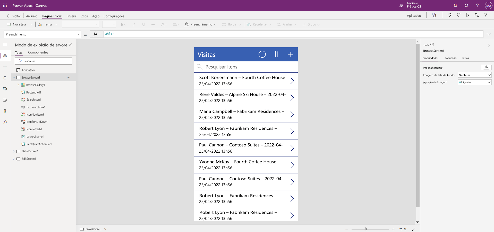

---
lab:
  title: 'Laboratório 2: Como criar um aplicativo de tela'
  module: 'Module 3: Get started with Power Apps'
---

# Laboratório 2: Como criar um aplicativo de tela

## Cenário

Bellows College is an educational organization with multiple buildings on campus. Campus visits are currently recorded in paper journals. The information is not captured consistently, and there are no means to collect and analyze data about the visits across the entire campus.

Currently, campus administration is leveraging an Excel spreadsheet to track visitor registration. They would like to modernize their visitor registration system where access to the buildings is controlled by security personnel and all visits are required to be pre-registered and recorded by their hosts.

Ao longo deste curso, você vai criar aplicativos e fazer automações para permitir que a administração e a equipe de segurança do Bellows College gerenciem e controlem o acesso aos edifícios no campus.

## Macroetapas do laboratório

Seguiremos o esquema abaixo para projetar o aplicativo de tela:

- Criar um aplicativo de tela com base nos dados na tabela Visita

- Configurar como as visitas são mostradas na tela de navegação

- Fazer algumas alterações básicas no aplicativo

- Testar a funcionalidade do aplicativo

## Pré-requisitos

- Conclusão do **Módulo 0 Laboratório 0 - Validação do ambiente de laboratório**
- Conclusão do **Laboratório 1 do Módulo 2 – Modelagem de Dados**

## Exercício 1: Criar aplicativo Tela de Visitas

**Objetivo:** neste exercício, você criará um aplicativo de tela conectando a tabela Visitas criada anteriormente.

### Tarefa \#1: Criar o aplicativo Visitas

1.  Navigate to <ph id="ph1">&lt;https://make.powerapps.com&gt;</ph>. You may need to reauthenticate - click <bpt id="p1">**</bpt>Sign in<ept id="p1">**</ept> and follow instructions if needed.

2.  No canto superior direito, selecione o ambiente **Prática [minhas iniciais]** se ainda não tiver selecionado.

3.  If necessary, click the <bpt id="p1">**</bpt>Home<ept id="p1">**</ept> icon on the left side of the screen. Under the <bpt id="p1">**</bpt>Start from<ept id="p1">**</ept> section, select <bpt id="p2">**</bpt>Dataverse<ept id="p2">**</ept>.

4.  Selecione a conexão do Dataverse.

    > **Observação:** *Se não houver uma conexão do Dataverse:*
    > - Selecione **Nova Conexão**
    > - Localize o **Microsoft Dataverse**
    > - Clique em **Criar**

5.  Localize e selecione a tabela **Visitas** criada no laboratório anterior.

6.  Selecione o botão **Conectar** no canto inferior direito.

7.  Após o aplicativo ser criado, na tela Boas-vindas ao Power Apps Studio, marque a caixa **Não mostrar isso novamente** e selecione **Ignorar**.

8.  Após a criação ser concluída, ele deve ser semelhante à imagem abaixo.

9. O Bellows College é uma organização educacional que possui um campus com vários edifícios.

10. Feche a visualização do aplicativo clicando em **X** no canto superior direito da tela.

Atualmente, as visitas ao campus são registradas em diários de papel.

### Tarefa \#2: Modificar e criar um tema para o aplicativo recém-criado

Nesta tarefa, você personalizará o texto do cabeçalho em cada uma das três telas do aplicativo (Procurar, Detalhes e Editar) e alterará o tema do aplicativo.

1.  As informações não são coletadas de forma consistente e não há meios de analisar os dados sobre as visitas em todo o campus.

1.  No lado direito da tela, na guia Propriedades, atualize a propriedade de controle **Texto** para **"Visitas a Bellows College"** .

1. Nas propriedades, altere o **Tamanho da fonte** para **24**.

1.  Clique no fundo em branco da tela para ver o texto atualizado na tela de navegação.

1.  Usando o modo de exibição de árvore na navegação esquerda, selecione **DetailScreen1**.

1.  Selecione o rótulo **Visitas** na tela.

1.  No lado direito da tela, na guia Propriedades, atualize a propriedade de controle **Texto** para **"Detalhes da visita"** .

1.  Clique no fundo em branco da tela para ver o texto atualizado na tela Detalhes.

1.  Usando o modo de exibição de árvore esquerdo, selecione **EditScreen1** (talvez seja necessário rolar a tela para ver isso no modo de exibição de árvore).

1.  Selecione o rótulo **Visitas** na tela.

1.  No lado direito da tela, na guia Propriedades, substitua o texto Table1 na propriedade de controle **Texto** por **"Editar detalhes"** .

1.  Clique no fundo em branco da tela para ver o texto atualizado na tela Editar.

1. Usando o modo de exibição de árvore na navegação esquerda, selecione **BrowseScreen1**.

1. Na barra de ferramentas de comando, selecione o botão **Tema** e, na lista exibida, selecione a cor do tema **Vermelho**.

### Tarefa \#3: Testar o aplicativo de Visitas

Nesta tarefa, você testará seu novo aplicativo.

1.  Com o aplicativo aberto no Designer de Aplicativo, selecione **Arquivo**, atualize o nome do aplicativo para **Aplicativo de Visitas** e selecione **Salvar**.

2.  Selecione a seta **voltar** para retornar ao seu aplicativo.

3.  Usando a navegação à esquerda, selecione **BrowseScreen1**.

4.  In the app designer, select the <bpt id="p1">**</bpt>preview the app<ept id="p1">**</ept> button (Play icon) on the command bar. <bpt id="p1">*</bpt>(You can also preview the app by pressing F5 on your keyboard.)<ept id="p1">*</ept>

4.  Quando o aplicativo for aberto, no campo **Pesquisar Itens**, insira o texto **Maria**
    * (observe como os itens na galeria são filtrados com base no que é digitado no campo de pesquisa).*

5.  Atualmente, a administração do campus está usando uma planilha do Excel para acompanhar o registro de visitantes.

6.  Para editar o registro, selecione o **Ícone de lápis** no canto superior direito do aplicativo.

7.  Você pode editar o nome da visita aqui e clicar no ícone de marca de seleção no canto superior direito para salvar a alteração.

8.  No canto superior direito da tela, clique no ícone **X** para retornar ao editor do aplicativo de tela.

Eles querem modernizar o sistema de registro de visitantes, em que o controle de acesso aos edifícios é feito pelo pessoal de segurança e todas as visitas precisam ser registradas previamente e gravadas pelos anfitriões.

## Desafios

- Adicione as seguintes colunas aos formulários em DetailScreen1 e EditScreen1: Início real, Término real, Código, Início agendado e Término agendado