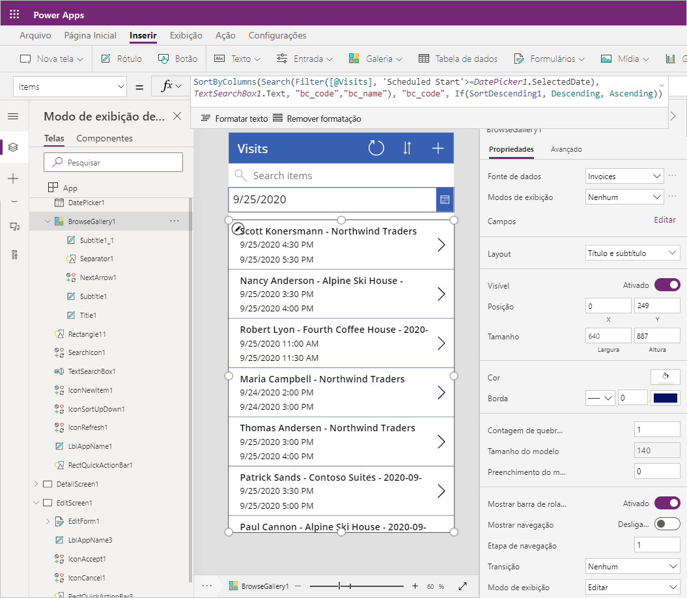

---
lab:
    title: 'Laboratório 2: Como criar um aplicativo de tela, Parte 1'
    module: 'Módulo 3: Introdução ao Power Apps'
---

# Módulo 3: Introdução ao Power Apps

## Laboratório: Como criar um aplicativo de tela, Parte 1

# Cenário

O Bellows College é uma organização educacional que possui um campus com vários edifícios. Atualmente, as visitas ao campus são registradas em diários de papel. As informações não são coletadas de forma consistente e não há meios de analisar os dados sobre as visitas em todo o campus. 

A administração do campus quer modernizar o sistema de registro de visitantes, com controle do acesso aos edifícios pelo pessoal de segurança, além de exigência de notificação prévia e registro de todas as visitas pelos anfitriões.

Ao longo deste curso, você vai criar aplicativos e fazer automações para permitir que a administração e a equipe de segurança do Bellows College gerenciem e controlem o acesso aos edifícios no campus.  

Na parte 1 deste laboratório, você vai projetar no Power Apps um aplicativo de tela que pode ser usado pela equipe da instituição para gerenciar as visitas dos convidados.

# Macroetapas do laboratório

Seguiremos o esquema abaixo para projetar o aplicativo de tela:

-   Criar o aplicativo a partir de dados usando o modelo de fator forma do telefone
-   Configurar uma página de detalhes com informações da visita
-   Configurar uma página de edição para criar visitas
-   Configurar um controle de galeria para mostrar as visitas
-   Adicionar filtragem na fonte de dados da galeria para mostrar apenas visitas futuras

## Pré-requisitos

* Conclusão do **Módulo 0 Laboratório 0 - Validação do ambiente de laboratório**
* Conclusão do **Módulo 2 Laboratório 1 - Introdução ao Microsoft Dataverse**

## Considerações antes de começar

-   Qual é o fator forma predominante para o público-alvo?
-   Estimar o número de registros que serão armazenados no sistema 
-   Como limitar os registros selecionados para melhorar o desempenho do aplicativo e a adoção do usuário?

# Exercício \#1: criar o aplicativo de tela dos funcionários

**Objetivo:** Neste exercício você vai criar um aplicativo de tela a partir de um modelo e, em seguida, vai modificá-lo para incluir os dados necessários.

## Tarefa 1: Criar aplicativo de tela

Nesta tarefa você vai criar um aplicativo de tela usando o modelo de layout do telefone com base no Microsoft Dataverse. Ao usar Visitas como uma tabela selecionada do Dataverse, o modelo gera um aplicativo Galeria – Exibir – Editar para gerenciar visitas ao campus.

1.  Comece criando um aplicativo a partir de dados

    -   Faça login em <https://make.powerapps.com>

    -   Selecione o **ambiente** no canto superior direito, se ele ainda não estiver definido
        para o seu ambiente de Prática.

    -   Selecione o ícone **Dataverse** em **Começar a partir de dados** na tela Página inicial.

2.  Conectar à tabela Visitas
    
    -   Selecione **+ Nova conexão**

    -   Selecione **Microsoft Dataverse** e clique em **Criar**

    -   Localize e selecione a tabela **Visitas**

    -   Selecione **Conectar**

3.  A janela **Boas-vindas ao Power Apps Studio** pode ser exibida. Clique em **Ignorar**.

4.  Salve o aplicativo

    -   Clique em **Arquivo \> Salvar**.

    -   Insira [Seu sobrenome] Equipe do Campus como o **Nome do aplicativo**.

    -   Clique em **Salvar**.

## Tarefa 2: configurar o formulário Detalhes das visitas

Nesta tarefa você configurará o formulário Detalhes para exibir informações sobre os registros de visitas individuais.

1. Selecione a seta **Voltar** canto esquerdo para voltar às definições do aplicativo.

2. Expanda **DetailScreen1** em **Modo de exibição de árvore**.

3.  Selecione **DetailForm1**.

4.  Selecione **Editar campos**, próximo de **Campos** no painel à direita.

5.  Clique em **Adicionar campo**.

6.  Selecione os seguintes campos:

    * Fim real
    
    * Início real
    
    * Edifício 
    
    * Código
    
    * Fim agendado
    
    * Início agendado
    
    * Visitante
    
7.  Clique em **Adicionar**.

8.  Para reordenar os campos no painel **Campos**, arraste e solte os nomes dos campos para cima e para baixo. A ordem recomendada é:
    * Código, Nome, Prédio, Visitante, Início programado, Fim programado, Início real, Fim real
    >**Dica:** Para recolher um campo, clique na seta para baixo ao lado do nome do campo.

9.  Para remover o campo **Criado em**, clique nas reticências (**...**) ao lado do nome do campo e selecione **Excluir**. 

10.  Feche o painel **Campos**.
 
11.  Para preservar o trabalho em andamento, clique em **Arquivo** e depois clique em **Salvar**. Use a seta voltar para retornar ao aplicativo.

## Tarefa 3: configurar o formulário Editar visitas

Nesta tarefa você configurará o formulário para editar linhas com as informações sobre as visitas individuais.

1.  Expanda **EditScreen1** em **Modo de exibição de árvore**.

2.  Selecione **EditForm1**.

3.  Selecione o campo **Criado em** e clique na tecla **Del** para removê-lo.

4.  Selecione **Editar campos** no painel de propriedades.

5.  Clique em **Adicionar campo**.

6.  Selecione os seguintes campos:

    * Edifício 
    
    * Fim agendado
    
    * Início agendado
    
    * Visitante
    
7.  Clique em **Adicionar**.

8.  Para reordenar os campos no painel **Campos**, arraste e solte os nomes dos campos para cima e para baixo. A ordem recomendada é:
    
    * Nome, Prédio, Visitante, Início programado, Fim programado
    >**Dica:** Para recolher um campo, clique na seta para baixo ao lado do nome do campo. 

9.  Feche o painel **Campos**.

10.  Para preservar o trabalho em andamento, clique em **Arquivo** e depois clique em **Salvar**. Use a seta voltar para retornar ao aplicativo.

Sua tela deve ter uma aparência semelhante à seguinte.


## Tarefa 4: configurar a galeria Visitas

Nesta tarefa você configurará a galeria pré-gerada para exibir o título, a data de início e a data de término da visita. 

1.  Expanda **BrowseScreen1** em **Modo de exibição de árvore**.

2.  Selecione **BrowseGallery1**.

3.  Selecione a propriedade **TemplateSize** no painel Propriedades avançadas à direita.

4.  Substitua a expressão com o seguinte texto: `Min(150, BrowseGallery1.Height - 60)`. Isso garante que haja espaço suficiente para informações adicionais.

5.  Na visualização do aplicativo, selecione o primeiro campo ‘Data e Hora’ na galeria.

6.  Na barra da fórmula, na parte superior, troque **hisItem.'Created On'** por `ThisItem.'Scheduled Start'`.

7.  Selecione novamente o campo.

8.  Pressione **CTRL + C** e depois **CTRL + V** para copiar o campo.

9.  Usando o mouse ou o teclado, mova o controle copiado para baixo e o alinhe com os outros controles na galeria, abaixo do outro campo Data e Hora.

10.  Na barra da fórmula, na parte superior, troque **ThisItem.'Scheduled Start'** por `ThisItem.'Scheduled End'`.

11.  Para preservar o trabalho em andamento, clique em **Arquivo** e depois clique em **Salvar**. Use a seta voltar para retornar ao aplicativo.

## Tarefa 5: adicionar um filtro de data

Como o número de visitas cresce continuamente, os usuários precisam de um recurso para filtrar a galeria de visitas. Por exemplo, quando o usuário quer ver somente as visitas futuras. Nesta tarefa, você adicionará a funcionalidade de exibir somente as visitas a partir de uma data selecionada pelo usuário.

1. Selecione **BrowseScreen1**.

2. Selecione o menu **Inserir**, na parte superior.

3. Clique em **Inserir** e selecione **Seletor de data**.

4. Usando o teclado ou o mouse, posicione o controle abaixo da caixa de pesquisa.

5. Selecione **BrowseGallery1**. 

6. Redimensione e mova o controle da galeria para que fique abaixo do seletor de data e cubra a tela. Para fazer isso, você pode clicar no ícone de redimensionamento, na parte superior central do controle da galeria, e redimensionar o controle para iniciar após o seletor de data.

7. Depois de selecionar **BrowseGallery1**, clique na guia **Avançado** do painel Propriedades.

8. Localize a propriedade **Itens** e clique na caixa de texto.

9. Na expressão, localize **[@Visits]** e substitua por `Filter(Visits,'Scheduled End' >= DatePicker1.SelectedDate)`. A expressão completa deverá ter a aparência a seguir.

   ```
   SortByColumns(
   	Search(
        Filter(
        	Visits,
            'Scheduled End' >= DatePicker1.SelectedDate
           ),
           TextSearchBox1.Text,
       	"bc_code","bc_name"
       ),
     "bc_scheduledstart",
     If(SortDescending1, Descending, Ascending)
   )
   ```
   
10. Para preservar o trabalho em andamento, clique em **Arquivo** e depois clique em **Salvar**. Use a seta voltar para retornar ao aplicativo.

Sua tela deve ter uma aparência semelhante à seguinte.



# Exercício 2: concluir o aplicativo

Neste exercício, você testará o aplicativo e o adicionará o aplicativo à sua solução se ele se ele estiver aprovado.

## Tarefa 1: testar o aplicativo

1.  Inicie o aplicativo

    -   Selecione **BrowseScreen1** e pressione Função **F5**, ou clique no ícone **Executar** no canto superior direito para exibir o aplicativo.
    
    -   O aplicativo é carregado e exibe a lista de visitas. 
    
    -   Selecione datas diferentes no controle seletor de datas para testar o filtro.
    
    -   Selecione uma visita e verifique se o formulário de exibição funciona corretamente.
    
    -   Retorne para a galeria e pressione **+** para criar uma visita. Verifique se o formulário de edição contém colunas obrigatórias, incluindo visitante, prédio e datas programadas de início e fim.
    
    -   Preencha as informações e envie. Verifique se o novo registro aparece na galeria.
    
    -   Crie pelo menos mais 2 visitas.
    
    -   Pressione a tecla **ESC** ou clique no ícone **X** para fechar o modo de visualização.

2.  Salve e publique o aplicativo.

    -   Clique em **Arquivo** e, se o botão Salvar for exibido, clique em **Salvar**.

    -   Clique em **Publicar**.

    -   Clique em **Publicar esta versão**.

    -   Use a seta **Voltar** para retornar ao aplicativo.

    -   Feche a janela ou a guia **Designer** do navegador.

    -   Se solicitado, clique em **Sair** ao tentar fechar a janela do navegador.

## Tarefa 2: adicionar o aplicativo à solução e publicar. 

1. Abra a solução Gerenciamento do campus.

   * Faça login em <https://make.powerapps.com>
   
   * Se o Ambiente exibido no canto superior direito não for o seu ambiente de Prática, selecione o **Ambiente**. 
   
   * Selecione **Soluções**.
   
   * Clique para abrir a solução **Gerenciamento de Campus**.
   
2. Selecione **Adicionar existente**, depois clique em **Aplicativo** e em **Aplicativo de tela**.

3. Selecione a guia **Dataverse externa**.

4. Selecione o aplicativo **Equipe do campus**, clique em **Adicionar**.

5. Selecione **Publicar todas as personalizações**.

# Desafios

* Exiba um calendário de todas as visitas e filtre por intervalo de datas
* Implemente no aplicativo a funcionalidade de criar e gerenciar contatos
* Como exibir vários encontros durante uma única visita?

