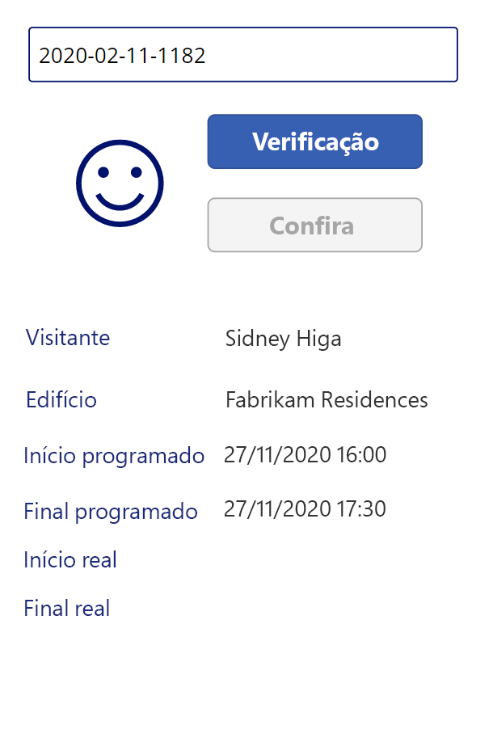

---
lab:
    title: 'Laboratório 3: Como criar um aplicativo de tela, parte 2'
    module: 'Módulo 3: Introdução ao Power Apps'
---

# Módulo 3: Introdução ao Power Apps
## Laboratório 2: Como criar um aplicativo de tela, parte 2

# Cenário

O Bellows College é uma organização educacional que possui um campus com vários edifícios. Atualmente, as visitas ao campus são registradas em diários de papel. As informações não são coletadas de forma consistente e não há meios de analisar os dados sobre as visitas em todo o campus. 

A administração do campus quer modernizar o sistema de registro de visitantes, com controle do acesso aos edifícios pelo pessoal de segurança, além de exigência de notificação prévia e registro de todas as visitas pelos anfitriões.

Ao longo deste curso, você vai criar aplicativos e fazer automações para permitir que a administração e a equipe de segurança do Bellows College gerenciem e controlem o acesso aos edifícios no campus. 

Na parte 2 deste laboratório, você desenvolverá e criará um aplicativo de tela no Power Apps que a equipe de segurança usará nas entradas do edifício para confirmar e registrar os visitantes com rapidez.

# Macroetapas do laboratório

Siga a estrutura de tópicos abaixo para desenvolver o aplicativo de tela:

-   Crie o aplicativo usando o formato do telefone
-   Conecte-se ao Dataverse como uma fonte de dados
-   Localize a linha do visitante através de seu código
-   Configure um controle de visualizador em formulário para exibir as informações do visitante
-   Utilize uma visualização do Dataverse para preencher a galeria
-   Controle o processo de entrada e saída de um visitante

## Pré-requisitos

* Conclusão do **Módulo 0 Laboratório 0 - Validação do ambiente de laboratório**
* Conclusão do **Módulo 2 Laboratório 1 - Introdução ao Microsoft Dataverse**

## Considerações antes de começar

-   A quais informações um agente de segurança precisa ter rápido acesso?
-   O que deve acontecer caso o código do visitante seja inválido?
-   O que deve acontecer caso o visitante chegue fora do horário programado?

# Exercício \#1: Criar o aplicativo de tela de segurança

**Objetivo:** Neste exercício, você criará um Aplicativo de tela.

## Tarefa 1: Criar aplicativo de tela

1.  Abra a solução Gerenciamento de Campus.

    -   Faça login em <https://make.powerapps.com>

    -   Se o Ambiente exibido no canto superior direito não for o seu ambiente de Prática, selecione o **Ambiente**. 

    -   Selecione **Soluções**.

    -   Clique para abrir a solução **Gerenciamento de Campus**.
    
2.  Criar um novo aplicativo de tela

    -   Clique em **Novo** e selecione **Aplicativo \| Aplicativo de Tela**.

    -   No aplicativo de tela de uma janela em branco, insira **[Seu Sobrenome] Segurança do Campus** no campo de nome do aplicativo.

    -   Selecione **Telefone** no campo de formato.

    -   Clique em **Criar**.
        O Editor de Aplicativos será aberto em uma Nova janela. Clique em **Pular** caso apareça a caixa de diálogo Bem-vindo ao Power Apps Studio.
    
3.  Salvar o aplicativo de tela

    -   Clique em **Arquivo** e selecione **Salvar como**.
    
    -   Verifique se **A nuvem** está selecionada clique em **Salvar**.

    -   Verifique **[Seu Sobrenome] Segurança do Campus** para Nome e clique em **Salvar**.
        
    -   Clique na seta **Voltar** no canto superior esquerdo (abaixo de Power Apps) para retornar ao aplicativo.

3.  Conectar às fontes de dados (Visitas)

    -   Clique em **Visualizar \| Fontes de dados**
    
    -   Clique em **+ Adicionar dados**

    -   Clique em **Ver todas as tabelas**
    
    -   Selecione **Visitas** e aguarde a exibição da tabela Visita na guia Dados.
    
4.  Para preservar o trabalho em andamento, clique em **Arquivo** e depois clique em **Salvar**. Use a seta voltar para retornar ao aplicativo.

## Tarefa 2: Exibir informações do Visitante

1.  Adicionar caixa de pesquisa

    -   Selecione a tabela **Modo de exibição em árvore** na barra de navegação à esquerda.
    
    -   Selecione **Tela1**.
    
    -   Acesse a guia **Inserir**.
    
    -   Clique em **Texto** e selecione **Entrada de texto**.
    
2.  Editar o objeto de entrada de texto

    -   Enquanto seleciona o objeto de entrada de Texto, escolha o texto na propriedade **Padrão** e limpe o valor.
    
    -   Selecione a propriedade **Dica de Texto** e digite `"Enter visitor code"` como o valor (incluindo as aspas)
    
    -   Clique em **[...]** ao lado do nome do controle na visualização em árvore (TextInput1), selecione **Renomear** e altere o nome para `textCode`
    
3.  Adicionar um modo de exibição Formulário

    -   Na guia **Inserir** clique em **Formulários** e selecione **Exibir** (pode ser necessário clicar na seta para baixo no lado direito da faixa de opções para exibir Formulários)
   
    -   Arraste para posicionar o formulário e alinhá-lo com a parte inferior da tela
   
    -   Enquanto seleciona o novo formulário, escolha a propriedade **DataSource** e depois **Visitas**
   
    -   No painel de propriedades, selecione **Horizontal** como **Layout**

4.  Editar modo de exibição em formulário

    -   Enquanto seleciona o novo formulário, clique em **Editar campos**

    -   Remova os campos **Nome** e **Criado em**

    -   Clique em **Adicionar campo** e selecione os campos a seguir: **Fim Real**, **Início Real**, **Edifício**, **Fim Programado**, **Início Programado**, **Visitante**
   
    -   Clique em **Adicionar**
   
    -   Altere a ordem dos campos selecionados arrastando os cartões do campo pela lista. A ordem recomendada é: Visitante, Edifício, Início Programado, Fim Programado, Início Real, Fim Real (é possível minimizar os campos para torná-los mais fáceis de arrastar)
   
    -   Clique no **X** para fechar o painel Campos
   
5.  Enquanto seleciona o modo de exibição em formulário, selecione a guia Avançado no painel Propriedades. Selecione a propriedade **Item** e insira `LookUp(Visits, Code = textCode.Text)` 

6.  Para preservar o trabalho em andamento, clique em **Arquivo** e depois clique em **Salvar**. Use a seta voltar para retornar ao aplicativo.

7.  Preparo para testar o aplicativo

    -   Mudar para a guia do navegador que contém a solução

    -   Clique em **Concluído** na janela pop-up
   
    -   Selecione a tabela **Visita**
   
    -   Selecione a guia **Dados**
   
    -   Abra o Seletor de Modo de Exibição no canto superior direito clicando no nome do Modo de Exibição atual, **Visitas ativas**
   
    -   Altere o modo de exibição para **Todas as colunas**
   
    -   Localize uma linha de Visita que não tenha valor de Início Real nem Final Real (ou seja, ambas as colunas estão em branco). Selecione e copie o **Código** para essa Visita.

8.  Testar o aplicativo

    -   Mude para a guia do navegador com o aplicativo, pressione **F5** ou clique no ícone **Executar** no canto superior direito para ter uma pré-visualização do aplicativo.
   
    -   Cole o valor copiado na caixa de pesquisa e verifique se o registro é exibido no formulário
   
9.  Limpe o conteúdo da caixa de pesquisa.
   
10.  Pressione **ESC** para sair do aplicativo em execução.

## Tarefa 3: Adicionar Botões de Check-In e Check-Out

Nesta tarefa, criaremos botões para o usuário fazer check-in e check-out das visitas. 

1. Salvar os resultados da pesquisa em uma variável para reutilizar no controle

    * Selecione o controle **textCode**
   
    * No painel de propriedades, selecione a guia **Avançado** e selecione a propriedade **OnChange**
   
    * Insira a seguinte expressão `Set(Visit, LookUp(Visits, Code = textCode.Text))`
    
    > A visita será salva em uma variável geral quando um usuário pesquisar na caixa de pesquisa textCode. Agora podemos usar a variável *Visita* em todo o aplicativo sem a necessidade de inserir novamente toda a expressão de pesquisa.

2. Adicionar Botão de Check-In

   * Selecione a guia **Inserir**
   
   * Clique em **Botão**
   
   * No painel de propriedades, altere a propriedade **Texto** do botão para "`Check In`" (você pode digitar dentro das aspas existentes)
   
   * Clique em **[...]** próximo ao nome do botão na visualização em árvore (Button1), selecione **Renomear** e altere o nome para `CheckInButton`

3. Adicionar Botão de Check-Out   

   * Clique em **Botão** na guia Inserir para adicionar outro botão
   
   * No painel de propriedades, altere a propriedade **Texto** do botão para "`Check Out`" (é possível digitar dentro das aspas existentes)
   
   * Renomeie o botão para `CheckOutButton`
   
   * Posicione os botões abaixo da caixa de pesquisa, com **Check In** acima de **Check Out** 
   
## Tarefa 4: Ativar e desativar botões de acordo com os dados da visita

Depois que os usuários pesquisarem o código da visita, use o botão Check-in para fazer a verificação de entrada dessa visita. Habilitar o botão **Check In** quando o registro da visita for localizado (não estiver em branco), o status do registro estiver ativo e a visita ainda não tiver começado, ou seja, quando o valor do início real estiver em branco.

1. Selecione o **Botão Check In** e clique na propriedade **Modo de Exibição** do botão na guia Propriedades.

2. Insira a expressão abaixo na barra de funções:

      ```
      If(!IsBlank(Visit) 
      && Visit.Status = 'Status (Visits)'.Active
      && IsBlank(Visit.'Actual Start'),
          DisplayMode.Edit,
          DisplayMode.Disabled
      )
      ```

   A expressão pode ser dividida da seguinte forma:

   * **!IsBlank(Visit)** - registro da visita foi encontrado
   * **&&** - lógico E operador
   * **Visit.Status = 'Status (Visits)'.Active** o status do registro está *Ativo*
   * **IsBlank(Visit.'Actual Start')** - O campo Início Ativo não contém nenhuma informação
   * **DisplayMode.Edit, DisplayMode.Disabled** - Se as condições acima forem atendidas, o botão poderá ser editado. Caso contrário, o botão permanecerá desabilitado.

Habilitar o botão **Check Out** quando o registro da visita for localizado (não estiver em branco), o status do registro estiver ativo e a visita já tiver começado, ou seja, o valor do início real não estiver em branco.

3. Selecione o botão Check-Out e clique na propriedade **Modo de exibição** do botão na guia Propriedades

4. Insira a expressão abaixo na barra de funções:

     ```
     If(!IsBlank(Visit) 
     && Visit.Status = 'Status (Visits)'.Active
     && !IsBlank(Visit.'Actual Start'),
         DisplayMode.Edit,
         DisplayMode.Disabled
     )
     ```

5. Para preservar o trabalho em andamento, clique em **Arquivo** e depois clique em **Salvar**. Use a seta voltar para retornar ao aplicativo.

6. Pressione **F5** para executar o aplicativo. 

7. Ambos os botões devem ser desabilitados. Insira o valor do código que foi copiado anteriormente e pressione **Tab** para sair da caixa de texto (ou clique fora da caixa de texto). O botão **Check-In** deverá ser habilitado. 

8. Limpe o conteúdo da caixa de pesquisa.

9. Pressione **ESC** para sair do aplicativo em execução.

## Tarefa 5: Concluir o Processo de Entrada (Check-in) e Saída (Check-out)

Para realizar o processo de check-in e check-out, é necessário atualizar os dados de visita do Dataverse da seguinte forma:

* Quando o visitante fizer check-in, defina o campo *Início Real* para a data e hora atuais.
* Quando o visitante fizer check-out, defina o campo *Fim Real* para a data e hora atuais. 
* Após a saída, defina o status do registro para inativo, indicando que a visita foi concluída

1. Selecione o botão **Check-In**.

2. Defina a propriedade **OnSelect** na guia Avançado para a seguinte expressão.

   ```
   Patch(
       Visits,
       Visit,
       {'Actual Start': Now()}
   );
   Refresh([@Visits]);
   Set(Visit, LookUp(Visits, Code = textCode.Text));
   ```

   Esta expressão contém as seguintes partes:

   * **Patch(Visits, Visit, {'Actual Start': Now()});**. O método *Patch* atualiza a tabela **Visitas**, a linha identificada pela variável **Visita** (que faz referência à visita atual). A expressão define o valor da coluna *Início Real* para a data e hora atuais (*Now()* method).
   * **Refresh([@Visits]);**. Esta expressão atualiza as linhas de visita, pois os valores subjacentes mudaram
   * **Set(Visit, LookUp(Visits, Code = textCode.Text));** Essa expressão atualiza a variável *Visita* com dados atualizados do Dataverse.
   
   > Quando um usuário clica neste botão, o Início Real da visita é definido como a data e hora atual e os dados serão atualizados.

3. Selecione o botão **Check-Out**.

4. Defina a propriedade **OnSelect** na guia Avançado para a seguinte expressão:

   ```
   Patch(
       [@Visits],
       Visit,
       {
           'Actual End': Now(),
           Status: 'Status (Visits)'.Inactive
       }
   );
   Refresh([@Visits]);
   Set(Visit, LookUp(Visits, Code = textCode.Text));
   ```

   Quando um usuário clicar neste botão, o Fim Real será definido para a data e hora atual, o Status da Visita será definido como Inativo e os dados serão atualizados.

5. Para preservar o trabalho em andamento, clique em **Arquivo** e depois clique em **Salvar**. Use a seta **Voltar** para retornar ao aplicativo.

6. Pressione **F5** ou clique no botão Executar para executar o aplicativo. Insira o valor do código que foi copiado anteriormente e pressione **Tab** para sair da caixa de texto. O botão **Check-In** deverá ser habilitado.

7. Pressione o botão **Check In**. A seguinte situação deve acontecer:

   * O **Início Real** é definido para a data e hora atuais
   
   * O botão **Check-In** é desabilitado
   
   * O botão **Check-Out** é habilitado

8. Pressione o botão **Check-Out**.

   * O **Final Real** é definido com a data e hora atuais
   
   * Ambos os botões são desabilitados

9. Limpe o conteúdo da caixa de pesquisa.

10. Pressione **ESC** para sair do aplicativo em execução.

## Tarefa 6: Adicionar indicadores visuais

A usabilidade de um aplicativo móvel melhora bastante quando indicadores visuais são fornecidos. Nesta tarefa, adicionaremos um ícone indicando se um visitante pode fazer check-in ou check-out.

1. Selecione a guia **Inserir**

2. Selecione **Ícones \| Adicionar**. Selecione um ícone. Neste ponto, não importa qual ícone selecionamos, pois queremos que o valor seja dinâmico.

3. Redimensione e coloque o ícone à esquerda dos botões

4. Na guia Avançado do Ícone, selecione a propriedade **Ícone** (na seção Design) e insira a seguinte expressão

   ```
   If(
      CheckInButton.DisplayMode = DisplayMode.Disabled 
   && CheckOutButton.DisplayMode = DisplayMode.Disabled,
       Icon.EmojiFrown,
       Icon.EmojiSmile
   )
   ```

5. Para preservar o trabalho em andamento, clique em **Arquivo** e depois clique em **Salvar**. Use a seta **Voltar** para retornar ao aplicativo.

6. Pressione **F5** para executar o aplicativo. Insira o valor do código que foi copiado anteriormente e pressione **Tab** para sair da caixa de texto. Verifique se o ícone exibe um Emoji carrancudo.

7. Encontre um valor de código diferente que não tenha sido usado antes (não deve ter um valor inicial real ou final real). 

    > É possível navegar até a guia anterior para copiar outro Código de uma das visitas já criadas. Também há a opção de executar o aplicativo da **Equipe do Campus** criado anteriormente para criar novos registros de visita. Verifique se o ícone exibe um Emoji de sorriso para este código.

O aplicativo em execução deve ser parecido com o seguinte:



8. Pressione **ESC** para sair do aplicativo em execução.

## Tarefa 7: Publicar o aplicativo

1. O aplicativo Segurança do Campus ainda deve estar aberto no navegador. Caso não esteja, selecione o aplicativo **Segurança do Campus** e clique em **Editar**.

2. Selecione **Arquivo \| Publicar** 

3. Selecione **Publicar essa versão**

# Desafios

* Evitar a entrada manual do código de visita
* Adicionar validação de edifício para a visita
* Adicionar validação da hora real da visita x hora agendada da visita (muito cedo, muito tarde, etc)
* Adicionar o status detalhado da visita. Por exemplo: exibição de email e validação para o visitante, motivo para negar o acesso ao prédio, etc
* Mais de um(a) edifício/reunião/check-in durante uma única visita ao campus. Por exemplo, alguém pode visitar o campus por um dia e, durante esse dia, se encontrar com membros da equipe em diferentes edifícios e em diferentes horários do dia. Você consideraria trazer uma entidade *compromisso* para a solução?
