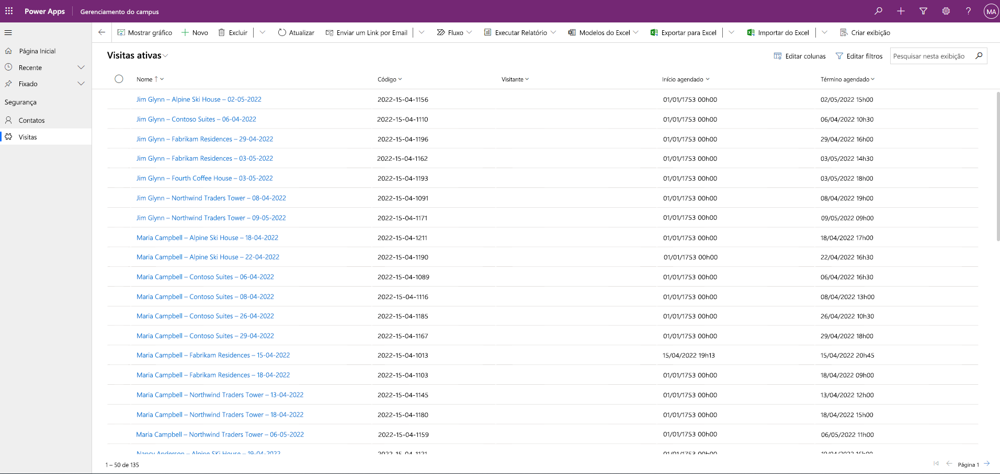

---
lab:
  title: 'Laboratório 3: Como criar um aplicativo baseado em modelo'
  module: 'Module 3: Get started with Power Apps'
---

# Laboratório 3: Como criar um aplicativo baseado em modelo

**Locatários do WWL – Termos de Uso** Se você estiver recebendo um locatário como parte de uma entrega de treinamento com instrutor, observe que o locatário é disponibilizado com a finalidade de dar suporte aos laboratórios práticos no treinamento com instrutor. Os locatários não devem ser compartilhados ou usados para fins fora dos laboratórios práticos. O locatário usado neste curso é um locatário de avaliação e não pode ser usado ou acessado após o fim da aula e não está qualificado para extensão. Os locatários não podem ser convertidos em uma assinatura paga. Os locatários obtidos como parte deste curso permanecem a propriedade da Microsoft Corporation e reservamos o direito de obter acesso e a qualquer momento. 

## Cenário

O Bellows College é uma organização educacional que possui um campus com vários edifícios. Atualmente as visitas ao campus são anotadas em papel. As informações não são coletadas de forma consistente e não há meios de analisar os dados sobre as visitas em todo o campus.

A administração do campus quer modernizar o sistema de registro de visitantes, com controle do acesso aos edifícios pelo pessoal de segurança, além de exigência de notificação prévia e registro de todas as visitas pelos anfitriões.

Ao longo deste curso, você vai criar aplicativos e fazer automações para permitir que a administração e a equipe de segurança do Bellows College gerenciem e controlem o acesso aos edifícios no campus.

Neste laboratório, você criará um aplicativo baseado em modelo do Power Apps para permitir que a equipe de apoio gerencie os registros de visitação de todo o campus.

## Macroetapas do laboratório

Você fará o seguinte para criar o aplicativo baseado em modelo:

- Crie um novo aplicativo baseado em modelo denominado Gerenciamento de Campus do Bellows

- Editar a navegação do aplicativo para fazer referência às tabelas necessárias

- Personalize os formulários e as exibições das tabelas necessárias para o aplicativo

Vamos trabalhar com os seguintes componentes:

- **Exibições**: As exibições permitem que o usuário exiba os dados atuais na tabela do formulário.

- **Formulários**: É onde o usuário cria/atualiza novas linhas nas tabelas.

Ambos serão integrados ao aplicativo baseado em modelo para oferecer uma melhor experiência do usuário.

## Pré-requisitos

- Conclusão do **Módulo 0 Laboratório 0 - Validação do ambiente de laboratório**

- Conclusão do **Laboratório 1 do Módulo 2 – Modelagem de Dados**

Considerações antes de começar

- Que mudanças precisamos fazer para melhorar a experiência do usuário?

- O que precisamos incluir em um aplicativo baseado em modelo de acordo com o modelo de dados que criamos?

- Quais personalizações podem ser feitas no mapa do site de um aplicativo baseado em modelo?

## Exercício 1: Personalizar exibições e formulários

**Objetivo:** Neste exercício, você vai personalizar as exibições e os formulários das tabelas personalizadas que serão usadas no aplicativo baseado em modelo.

### Tarefa 1: Editar o formulário de visitas

1.  Se você ainda não tiver entrado, entre em `https://make.powerapps.com` 

2.  Selecione o ambiente **Dev One** na parte superior direita, se ele ainda não estiver selecionado.

3.  Usando o painel de navegação à esquerda, selecione **Tabelas** e abra a tabela **Visita**.

    Se você não vir a tabela Visitas, verifique se está no ambiente correto (etapa 2).

4.  Na seção **Experiências de dados**, selecione **Formulários** e abra o formulário **Informações** com o tipo de formulário **Principal**. (**Importante:** selecione o formulário com o tipo de formulário **Principal**). 

    > **IMPORTANTE:** Como, por padrão, todos os formulários são denominados Informações, verifique se o formulário selecionado tem um Tipo de formulário **Principal** e não outro. Por padrão, o formulário tem dois campos: Nome e Proprietário.

5.  No lado direito da tela no painel **Propriedades**, selecione o campo **Nome de Exibição** e altere-o para `Main Information`

6.  Selecione **Colunas da tabela** no painel de navegação à esquerda e adicione os seguintes campos abaixo do campo **Proprietário** arrastando as colunas para o formulário ou simplesmente clicando nos nomes das colunas:

    1. **Visitante**

    2. **Início agendado**

    3. **Fim agendado**

    4. **Início real**

    5. **Término real**

7.  Arraste a coluna **Código** e solte-a no cabeçalho do formulário.

    O cabeçalho é a área superior direita do formulário. Pode ser necessário recolher o painel Propriedades do lado direito da tela para ver o campo no formulário.

8.  Com o campo **Código** ainda selecionado, marque a caixa de seleção **Somente leitura** no painel Propriedades no lado direito da tela.

9.  Selecione o campo **Proprietário**. No painel Propriedades, altere a **Etiqueta** para `Host`

10. Selecione o botão **Salvar e publicar** no canto superior direito e aguarde a conclusão do salvamento e da publicação.

11. Se a exibição Edição foi aberta em uma nova guia ou janela do navegador, feche-a. Caso contrário, selecione **🡠 Voltar** no canto superior esquerdo da tela. Agora você voltará aos formulários da tabela **Visita**.

12. Usando a trilha de navegação do canto superior esquerdo (**Tabelas** > **Visita** > **Formulários**). Selecione **Visita** para retornar à tela de propriedades da tabela **Visita**. 

### Tarefa 2: Editar a exibição Visitas ativas

Nesta tarefa, vamos modificar a exibição Visitas ativas e criar uma nova exibição para as visitas de hoje.

1.  Na seção **Experiências de dados**, escolha **Exibições** e abra a exibição **Visitas Ativas**.

2.  Inclua os campos a seguir à exibição ao clicar ou arrastar e soltar os campos:

    1. **Código**

    2. **Visitante**

    3. **Início agendado**

    4. **Fim agendado**

3.  Selecione o menu suspenso na coluna **Criado em** e escolha **Remover**. O campo **Criado em** será removido da exibição.

4.  Redimensione as larguras das colunas como desejar para ajustar os dados.

5.  Em **Classificar por ...** selecione o X para remover o **Nome** e, em vez disso, selecione **Início Agendado**.

6.  Escolha **Início Agendado** para alterar a ordem de classificação para **Mais recente para mais antigo**.

7.  Selecione o botão **Salvar e publicar** no canto superior direito e aguarde a conclusão da publicação.

### Tarefa 3: Criar uma exibição para as visitas de hoje

Agora, vamos clonar a exibição e criar uma para as visitas de hoje.

> **IMPORTANTE:** verifique se você não fechou a exibição Visitas Ativas, pois vamos usá-la para criar o modo de exibição de visitas de hoje.

1.  Selecione **Salvar como**.

2.  Altere o **Nome** para `Today’s Visits` e selecione **Salvar**.

3.  Escolha **Editar filtros** no painel Propriedades.

4.  Selecione **+ Adicionar** e **Adicionar linha**.

5.  Escolha **Início Agendado** como um campo e depois altere **É Igual a** para **Hoje** como a condição na lista suspensa.

6.  Selecione as **…** **Mais comandos** na linha **Status** e escolha **Excluir** para excluir essa condição de filtro.

7.  Escolha **OK** para salvar a condição. A exibição será filtrada para mostrar somente os registros em que a data de **Início Agendado** é hoje.

8.  Inclua os campos **Início real** e **Fim real** à exibição.

> **OBSERVAÇÃO:** como não filtramos mais no status de exibição, obteremos todas as visitas de hoje incluindo as concluídas. Esses campos ajudarão a diferenciar as visitas concluídas e as visitas em andamento.

9.  Selecione o botão **Salvar e publicar** no canto superior direito e aguarde a conclusão da publicação.

## Exercício 2: Criar aplicativo baseado em modelo

**Objetivo:** neste exercício, você criará o aplicativo baseado em modelo, personalizará o mapa do site e testará o aplicativo.

Para simplificar e economizar tempo, não abordaremos algumas das colunas Visita neste laboratório.

### Tarefa 1: Criar aplicativo

1.  Se você ainda não tiver entrado, entre em `https://make.powerapps.com` 

2.  Selecione o ambiente **Dev One** na parte superior direita, se ele ainda não estiver selecionado.

3.  Selecione **+ Criar** no painel de navegação à esquerda.

4.  Criar o aplicativo baseado em modelo:

    1. Escolha **Aplicativo em branco** na seção **Iniciar em** da tela **Criar seu aplicativo**.

    2. Em **Aplicativo em branco baseado no Dataverse**, selecione **Criar**.

    3. Insira `Bellows Campus Management` em **Nome** e escolha **Criar**.

5.  Quando o novo aplicativo baseado em modelo for carregado, selecione o botão **+ Adicionar Página**.

6.  Na tela **Adicionar Página**, escolha **Tabela do Dataverse** e selecione o botão **Avançar**.

7.  Escolha as seguintes tabelas:

    1. Visite

    2. Contact

8.  Quando tiver as duas tabelas, selecione **Adicionar**.

9.  Usando os ícones de navegação no lado esquerdo da tela, selecione **Navegação**.

10. No painel de navegação, selecione **Novo Grupo** abaixo do item Navegação. Talvez seja necessário expandir o menu à esquerda.

11. No lado direito da tela, na seção **Opções de exibição**, altere a propriedade **Título** para `Security`

12. Selecione **Salvar** espere as alterações serem salvas.

13. Depois de **Salvar**, selecione o botão **Publicar** para publicar as alterações. Aguarde a conclusão da publicação.

### Tarefa nº 2: Testar app

Iniciar o aplicativo

1. Selecione o botão **Reproduzir**, e o novo aplicativo baseado em modelo será carregado em uma nova guia.

Criar um contato

2.  O aplicativo abrirá a exibição **Meus Contatos Ativos** Se isso não acontecer, selecione **Contatos** no painel de navegação à esquerda.

3.  Escolha **+ Novo** na barra de comandos.

4.  Insira **Nome** como `John` e **Sobrenome** como `Doe`

5.  Informe seu email pessoal como **e-mail**. Isso será usado em um laboratório futuro, em que você receberá um email.

6.  Selecione **Salvar &amp; Fechar**.

7.  Agora, você verá o contato criado na exibição **Meus Contatos Ativos**.

Criar uma visita

8.  Selecione **Visitas** no painel de navegação à esquerda (também conhecido como mapa do site).

9.  Selecione **+ Novo**.

10. Insira os campos da seguinte maneira:

    1. **Nome**: `New test visit`

    2. **Visitante**: selecione **Matheus Silva**

    3. **Início Agendado**: escolha a data de amanhã e 14h como a hora de início

    4. **Término Agendado**: selecione a data de amanhã e 15h30 como a hora de término

11. Selecione **Salvar &amp; Fechar**. A visita será criada, e você poderá vê-la na exibição **Visitas Ativas**.

12. Altere a exibição para **Visitas de Hoje** usando o menu suspenso ao lado de **Visitas Ativas**. Você não verá mais a nova visita na exibição, pois ela foi agendada para amanhã.

13. Você poderá adicionar mais alguns registros de teste.

O aplicativo baseado em modelo em execução será parecido com o seguinte:

Parabéns! Você criou e configurou seu primeiro aplicativo controlado por modelos.

## Desafios

- Selecionar exibições e formulários específicos para Contatos.

