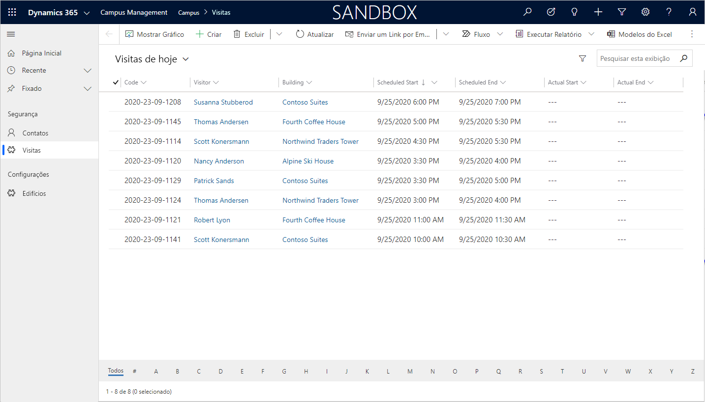

---
lab:
    title: 'Laboratório 4: Criar um aplicativo baseado em modelo'
    module: 'Módulo 3: Introdução ao Power Apps'
---

# Módulo 3: Introdução ao Power Apps
## Laboratório 3: Como criar um aplicativo baseado em modelo

### Aviso importante (Em vigor a partir de novembro de 2020):
O Common Data Service foi renomeado para Microsoft Dataverse. Algumas terminologias no Microsoft Dataverse foram atualizadas. Por exemplo, a entidade (agora, **tabela**), o campo (agora, **coluna**) e o registro (agora **linha**) podem estar desatualizados. Lembre-se disso ao participar do laboratório. Esperamos atualizar todo o conteúdo em breve.

Para obter mais informações e uma lista completa de termos afetados, visite [O que é o Microsoft Dataverse?](https://docs.microsoft.com/pt-br/powerapps/maker/common-data-service/data-platform-intro#terminology-updates)

# Cenário

O Bellows College é uma organização educacional que possui um campus com vários edifícios. Atualmente as visitas ao campus são anotadas em papel. As informações não são coletadas de forma consistente e não há meios de analisar os dados sobre as visitas em todo o campus. 

A administração do campus quer modernizar o sistema de registro de visitantes, com controle do acesso aos edifícios pelo pessoal de segurança, além de exigência de notificação prévia e registro de todas as visitas pelos anfitriões.

Ao longo deste curso, você vai criar aplicativos e fazer automações para permitir que a administração e a equipe de segurança do Bellows College gerenciem e controlem o acesso aos edifícios no campus. 

Neste laboratório, você criará um aplicativo baseado em modelo do Power Apps para permitir que a equipe de apoio gerencie os registros de visitação de todo o campus.

# Macroetapas do laboratório

Você fará o seguinte para criar o aplicativo baseado em modelo:

-   Crie um novo aplicativo baseado em modelo denominado Gerenciamento de campus

-   Editar a navegação do aplicativo para fazer referência às tabelas necessárias

-   Personalize os formulários e as exibições das tabelas necessárias para o aplicativo

Vamos trabalhar com os seguintes componentes:

- **Exibições**: As exibições permitem que o usuário exiba os dados atuais na tabela do formulário.

- **Formulários**: É onde o usuário cria/atualiza novas linhas nas tabelas.

Ambos serão integrados ao aplicativo baseado em modelo para oferecer uma melhor experiência do usuário.

## Pré-requisitos

* Conclusão do **Módulo 0 Laboratório 0 - Validação do ambiente de laboratório**
* Conclusão do **Módulo 2 Laboratório 1 - Introdução ao Microsoft Dataverse**

## Considerações antes de começar

-   Que mudanças precisamos fazer para melhorar a experiência do usuário?

-   O que precisamos incluir em um aplicativo baseado em modelo de acordo com o modelo de dados que criamos?
    
-   Quais personalizações podem ser feitas no mapa do site de um aplicativo baseado em modelo?

# Exercício \#1: Personalizar exibições e formulários

**Objetivo:** Neste exercício, você vai personalizar as exibições e os formulários das tabelas personalizadas que serão usadas no aplicativo baseado em modelo.

## Tarefa 1: Editar o formulário de visitas

1.  Entre em <https://make.powerapps.com> se ainda não tiver feito isso.

2.  Selecione o **ambiente.**

3.  Selecione **Soluções**.

4.  Clique para abrir a solução **Gerenciamento de Campus**.

5.  Clique para abrir a entidade **Visita**.

6.  Escolha a guia **Formulários** e clique para abrir o tipo de formulário **Principal**. 

    > Por padrão, o formulário tem dois campos: Nome (campo principal) e proprietário.
    
7.  Selecione **+ Campo de formulário** e inclua os seguintes campos abaixo do campo **Proprietário** arrastando as colunas para o formulário ou simplesmente clicando nos nomes das colunas:

    * **Edifício**
    * **Visitante**
    * **Início agendado**
    * **Fim agendado**
    * **Início real**
    * **Fim real** 
    
8.  Arraste a coluna **Código** e solte-a no cabeçalho do formulário. 

    > O cabeçalho é a área superior direita do formulário. Pode ser necessário minimizar o painel Propriedades do lado direito da tela para ver o campo no formulário.

9.  Com o campo **Código** ainda selecionado, marque a caixa de seleção **Somente leitura** no painel Propriedades.

10.  Selecione o campo **Proprietário**. No painel Propriedades, altere o **Rótulo do campo** para **Anfitrião**

11.  Clique em **Salvar** na parte superior direita e espere salvar para concluir.

12.  Clique em **Publicar** na parte superior direita e espere publicar para concluir.

13.  Clique em **Voltar** na parte superior esquerda da tela. Você deve estar de volta à
     guia Formulários de entidade de visita.

## Tarefa 2: Editar exibições de visita

Nesta tarefa, vamos modificar a exibição Visitas ativas e criar uma nova exibição para as visitas de hoje.

1.  Selecione a guia **Exibições** e clique para abrir a exibição **Visitas ativas**.

2.  Inclua os campos a seguir à exibição ao clicar ou arrastar e soltar os campos:

    *  **Código**
    *  **Visitante**
    *  **Edifício**
    *  **Início agendado** 
    *  **Fim agendado**
    
3.  Clique na coluna **Criado em** e selecione **Remover**. O campo **Criado em** será removido da exibição.

4.  Clique na coluna **Nome** e selecione **Remover**. O campo **Nome** será removido da exibição.

5.  No painel Propriedades à direita, clique em **Classificar por ...** e selecione **Início agendado**. Clique em **Início agendado** novamente para alterar a classificação para decrescente.

6.  Redimensione as larguras das colunas para ajustar os dados.

7.  Clique em **Salvar** e espere as alterações serem salvas.

8.  Clique em **Publicar** e espere a conclusão da publicação.

Agora, vamos clonar a exibição e criar uma nova para as visitas de hoje.

9.  Pressione o link **Editar filtros** no painel Propriedades.

10.  Clique em **Adicionar** e selecione **Incluir linha**.

11.  Selecione **Início agendado** como um campo, depois selecione **Hoje** como a condição na lista suspensa. 

12.  Clique em **[...]** na linha **Status** e clique em **Excluir**. 

13.  Pressione **Ok** para salvar a condição. A exibição agora é filtrada para mostrar somente registros em que a data de Início agendado é hoje.

14.  Inclua os campos **Início real** e **Fim real** à exibição. 

> **Observação:** como não filtramos mais no status de exibição, obteremos todas as visitas de hoje incluindo as concluídas. Esses campos ajudarão a diferenciar as visitas concluídas e as visitas em andamento.

15.  Clique na **seta da lista suspensa** ao lado do botão Salvar (cuidado para não pressionar o botão) e selecione **Salvar como**.

16.  Altere o nome para **Visitas de hoje** e pressione **Salvar**.

17.  Clique em **Publicar** e espere a conclusão da publicação.

# Exercício \#2: Criar aplicativo baseado em modelo

**Objetivo:** Neste exercício, você vai criar o aplicativo baseado em modelo, personalizar o mapa do site e testar o aplicativo.

> Você verá diversos campos sem endereço ao construir o aplicativo, especialmente nas etapas de mapa do site. Tomamos alguns atalhos para criar os laboratórios. Em uma implementação real, você daria nomes lógicos a esses itens.

## Tarefa 1: Criar aplicativo

1.  Abra a solução de Gerenciamento de Campus se já não tiver feito isso.

    -   Faça login em <https://make.powerapps.com>

    -   No ambiente, clique para abrir a solução **Gerenciamento de Campus**.
    
2.  Criar aplicativo baseado em modelo

    -   Clique em **Novo**, selecione **Aplicativo** e depois **Aplicativo baseado em modelo**. Isso abrirá uma nova guia.
    
    -   Insira **Gerenciamento de Campus do [Seu sobrenome]** em Nome.

    -   Marque a caixa de seleção **Usar solução existente para criar o aplicativo**

    -   Selecione **Próximo**

    -   Escolha a solução **Gerenciamento de campus**
    
    -   Clique em **Concluído**
    
3.  Clique no ícone de lápis próximo ao **Mapa do site.**

4.  Edite os títulos padrão

    -   Selecione **Nova área**.

    -   Mude o Título da Nova área para **Campus** no painel de propriedades à direita.

    -   Selecione **Novo grupo**.

    -   Mude o Título do Novo grupo para **Segurança** no painel de propriedades à direita.
    
5.  Inclua a tabela de Contatos ao mapa do site

    -   Selecione **Nova subárea**.

    -   No painel **Propriedades**, selecione **Entidade** na lista suspensa
        para **Tipo**.

    -   Procure a tabela **Contato** na lista suspensa para **Entidade**.
    
6.  Inclua a tabela de Visitas ao mapa do site

    -   Selecione o grupo **Segurança** e clique em **Adicionar**.

    -   Selecione **Subárea**.

    -   Vá para o painel **Propriedades**.

    -   Selecione **Entidade** na lista suspensa para **Tipo** e procure por
        **Visitas** na lista suspensa para **Entidade**.
    
7.  Inclua a tabela de Edifícios ao mapa do site

    -   Selecione a área **Campus** e clique em **Adicionar**.
    
    -   Selecione **Agrupar**.
    
    -   Insira **Configurações** para **Título** no painel **Propriedades**.
    
    -   Com o grupo **Configurações** ainda selecionado, clique em **Adicionar**.
    
    -   Selecione **Subárea**.
    
    -   Vá para o painel **Propriedades**.
    
    -   Escolha **Entidade** na lista suspensa para **Tipo** e procure por **Edifício** na lista suspensa para **Entidade**.

8.  Clique em **Salvar**. Isso mostrará a tela que está sendo carregada enquanto as mudanças são salvas.

9.  Clique em **Publicar** para publicar o mapa do site. Aguarde a publicação para concluir.

10.  Clique em **Salvar e fechar** para fechar o editor do mapa do site. 

    > Você verá que os recursos para as entidades adicionadas ao mapa do site agora estão no aplicativo.
     
11.  Clique em **Salvar** no Designer de aplicativo.

12.  Clique em **Validar** para confirmar as mudanças feitas no aplicativo. 

>  Alguns avisos serão exibidos, mas ignore-os, pois não foi feita referência a uma Exibição e um Formulário específico para as entidades e os usuários terão acesso a todas as Exibições e os Formulários para as entidades **Visitas** e **Edifício**.
     
13. Clique em **Publicar**

14.  Clique em **Salvar e fechar** para fechar o Designer de aplicativo.

15.  Clique em **Concluído**.

16.  Selecione **Soluções** e escolha **Publicar todas as personalizações.**

17.  Selecione **Aplicativos** e seu aplicativo aparecerá na lista.

## Tarefa 2: Testar o aplicativo

1.  Inicie o aplicativo

    -   Selecione **Aplicativos** e clique no aplicativo **Gerenciamento de Campus**. (Se você não vir o aplicativo, atualize o navegador.)

    -   O aplicativo será aberto em uma nova janela.
    
2.  Criar um novo contato

    -   O aplicativo abrirá a exibição **Contatos ativos**

    -   Clique em **Novo** no menu superior.

    -   Informe o **Nome** como `John` e o **Sobrenome** como `Doe`.

    -   Informe seu email pessoal como **e-mail**. Ele será usado em um próximo laboratório. 
    
    -   Clique em **Salvar e fechar**.

    -   Agora, você verá o contato criado na exibição **Contatos ativos**.
    
3.  Criar um novo edifício

    -   Selecione **Edifícios** no mapa do site.

    -   Clique em **Novo**.

    -   Insira o **Nome** como `Microsoft Building`
        
    -   Clique em **Salvar e fechar**. O registro recém-criado aparecerá na
        exibição Edifícios ativos.
    
4.  Criar uma nova visita

    -   Selecione **Visitas** no mapa do site.
    
    -   Clique em **Novo**.
    
    -   Preencha os campos da seguinte maneira 
    
        -   **Nome**: `New test visit`
        -   **Edifício**: selecione Edifício da Microsoft
        -   **Visitante**: selecione João Silva
        -   **Início agendado**: selecione a data de amanhã e 14h como hora de início
        -   **Fim agendado**: selecione a data de amanhã e 15h30 como hora de término
        
    -   Clique em **Salvar e fechar**. A visita será criada e você poderá vê-la na
        Exibição de visitas ativas.
        
    -   Altere a exibição para **Visitas de hoje**. Você não verá mais a nova visita na exibição, pois ela foi agendada para amanhã.
    
5. Você pode adicionar mais registros de teste.

   O aplicativo em execução deve ser parecido com o seguinte:

# Desafios

* Selecione exibições e formulários específicos para Visitas e Edifícios
* Equipes de segurança costumam trabalhar em um único edifício Como você proporcionaria a eles uma maneira fácil de exibir as visitas somente para um edifício selecionado?
* Restrinja o acesso a entidades específicas, por exemplo, edifícios devem ser somente para leitura para todos os membros da equipe, exceto para os administradores
* Quais Painéis você consideraria adicionar ao aplicativo?
