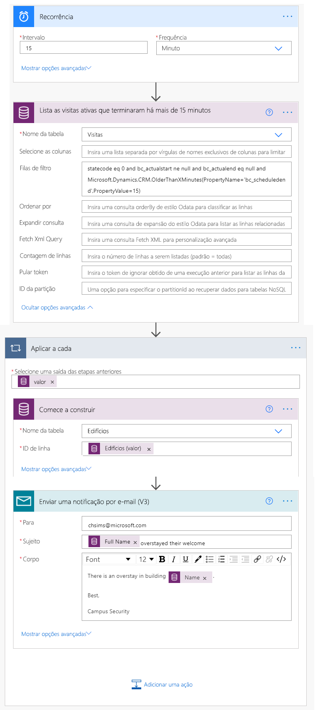

---
lab:
    title: 'Laboratório 6: Saiba como criar uma solução automatizada'
    module: 'Módulo 4: Introdução ao Power Automate'
---

# Módulo 4: Introdução ao Power Automate
## Laboratório: Saiba como construir uma solução automatizada

## Cenário

O Bellows College é uma organização educacional que possui um campus com vários edifícios. Atualmente as visitas ao campus são anotadas em papel. As informações não são coletadas de forma consistente e não há meios de analisar os dados sobre as visitas em todo o campus. 

A administração do campus quer modernizar o sistema de registro de visitantes, com controle do acesso aos edifícios pelo pessoal de segurança, além de exigência de notificação prévia e registro de todas as visitas pelos anfitriões.

Ao longo deste curso, você vai criar aplicativos e fazer automações para permitir que a administração e a equipe de segurança do Bellows College gerenciem e controlem o acesso aos edifícios no campus. 

Neste laboratório, você criará fluxos do Power Automate para automatizar várias partes do gerenciamento do campus. 

# Macroetapas do laboratório

Os pré-requisitos seguintes foram identificados para que o projeto seja concluído:

* O código exclusivo atribuído a cada visitante deve ser disponibilizado antes da visita.
* A equipe de segurança precisa receber notificações de visitantes que ultrapassam os horários programados.

## Pré-requisitos

* Conclusão do **Módulo 0 Laboratório 0 - Validação do ambiente de laboratório**
* Conclusão do **Módulo 2 Laboratório 1 - Introdução ao Microsoft Dataverse**
* Aplicativo Campus Staff criado no **Módulo 3 Laboratório 2 – Como construir um aplicativo de tela, parte 2** (teste)
* Contato John Doe criado com um endereço de email pessoal no **Módulo 3 Laboratório 4 - Como construir um aplicativo baseado em modelo** (teste)

## Considerações antes de começar

-   Qual o mecanismo de distribuição mais adequado para os códigos de visitantes?
-   Como medir o tempo de permanência excedente e aplicar políticas rígidas?

# Exercício \#1: Criar fluxo de Notificação de visita

**Objetivo:** Neste exercício será criado um fluxo no Power Automate que implementa o requisito. O visitante deverá receber um email com o código exclusivo atribuído à visita.

## Tarefa 1: Criar fluxo

1.  Abra a solução Gerenciamento de Campus.

    -   Faça login em <https://make.powerapps.com>

    -   Selecione o **ambiente.**

    -   Selecione **Soluções**.

    -   Clique para abrir a solução **Gerenciamento de Campus**.

2.  Clique em **Novo** e selecione **Automação**, **Fluxo da nuvem** e, então, **Automatizado**. Isso abrirá o editor de fluxo do Power Automate em uma nova janela.

3. Em **Escolher o gatilho do fluxo**, pesquise por **Microsoft Dataverse**.

4. Selecione o gatilho **Quando uma coluna for adicionada, modificada ou excluída**, e então clique em **Criar**.

   * Selecione **Adicionado** para **Alterar o tipo**
   
   * Selecione **Visitas** em **Nome da tabela**
   
   * Selecione **Organização** em **Escopo**
   
   * Na etapa de ativação, clique nas reticências (**...**) e clique em **Renomear**. Renomeie esse gatilho **"Quando uma visita é adicionada"**. Essas ações são importantes para que todos com permissão para editar o fluxo entendam o propósito da etapa sem precisar de maiores detalhes.

5. Selecione **Nova etapa**. Esta etapa é necessária para recuperar as informações dos visitantes, inclusive o endereço de email.

6. Pesquise por **Microsoft Dataverse**.

7. Selecione **Obter uma linha por ID**. 

   * Selecione **Contatos** em **Nome da tabela**
   
   * No campo **ID de linha**, selecione **Visitante (Valor)** na Lista de conteúdo dinâmico.
   
   * Neste momento, clique nas reticências (**...**) e clique em **Renomear**. Renomeie esta ação **"Criar visitante"**. Essas ações são importantes para que todos com permissão para editar o fluxo entendam o propósito da etapa sem precisar de maiores detalhes.

8. Clique em **Nova etapa**. Essa é a etapa que criará e enviará o email ao visitante.

9. Pesquise por *e-mail*, selecione o conector **Office 365 Outlook** e a ação **Enviar um email (V2)**.

   * Se precisar Aceitar os Termos e as Condições para usar esta ação, clique em **Aceitar**.
   
   * Selecione o campo **Para** e escolha **Email** na Lista de conteúdo dinâmico. Observe que está abaixo do cabeçalho **Criar visitante**. Isso significa que você está selecionando o email relacionado ao Visitante que foi consultado na etapa anterior. 

   * Insira **Sua visita agendada ao Bellows College** no campo **Assunto**.

   * Insira o seguinte texto no **Corpo do email**:  
        
        > O conteúdo dinâmico precisa ser inserido onde os campos são nomeados entre colchetes. É recomendado copiar e colar todo o texto primeiro e, em seguida, adicionar o conteúdo dinâmico nos locais corretos.
   
        ```
        Dear {First Name},

        You are currently scheduled to visit Bellows Campus from {Scheduled Start} until {Scheduled End}.

        Your security code is {Code}, please do not share it. You will be required to produce this code during your visit.

        Best regards,

        Campus Administration
        Bellows College
        ```
   
10.  Selecione o nome do fluxo **Sem Título** na parte superior e renomeie como `Visit notification`

11. Clique em **Salvar**

    Deixe esta guia de fluxo aberta para a próxima tarefa. Seu fluxo deve ser parecido com o seguinte:


## Tarefa 2: Validar e testar o fluxo

1.  Abra uma nova guia no navegador e acesse <https://make.powerapps.com>

2.  Clique em **Aplicativos** e selecione o aplicativo que você criou **Equipe do Campus**

3.  Deixe esta guia aberta, volte para a guia anterior com o fluxo. 

4.  Na barra de comandos, clique em **Testar**. Selecione **Manualmente** e, em seguida, **Salvar e Testar**.

5.  Deixe a guia de fluxo aberta e volte para a guia anterior com o aplicativo **Equipe do Campus**.

6.  Clique em **+** para adicionar um novo Registro de visita

7.  Insira **John Doe** em **Nome** e escolha um **Edifício**

8.  Escolha **John Doe** como **Visitante**

9.  Escolha as datas de **Início programado** e **Fim programado** para qualquer data no futuro.

10.  Clique no ícone **Marca de seleção** para salvar a nova visita

11.  Volte para a guia anterior com o teste do fluxo em andamento. Observe a execução do fluxo. Se houver algum erro, volte e compare seu fluxo com o exemplo acima. Se o email for enviado com sucesso, você o receberá em sua caixa de entrada. 

12.  Clique na seta para voltar na barra de comando

13.  Na seção **Detalhes**, note que o **Status** está configurado como **Ligado**. Significa que seu fluxo será executado sempre que uma nova visita for criada, até que você desligue. Sempre que for executado, o fluxo será adicionado à lista do **Histórico de execução dos últimos 28 dias**.

14.  Desligue o fluxo clicando em **Desligar** na barra de comandos. Pode ser necessário pressionar as reticências (**...**) para ver esta opção.

15.  Fechar esta janela.

# Exercício 2: Criar fluxo de Varredura de segurança

**Objetivo:** Neste exercício será criado um fluxo no Power Automate que implementa o requisito. Uma varredura de segurança deve ser realizada a cada 15 minutos e a equipe de segurança deve ser notificada se algum dos visitantes ultrapassar o horário programado.

## Tarefa 1: Criar um fluxo para recuperar registros

1. Abra a solução Gerenciamento de Campus.

   -   Faça login em <https://make.powerapps.com>

   -   Selecione o **Ambiente.**

   -   Selecione **Soluções**.

   -   Clique para abrir a solução **Gerenciamento de Campus**.

2. Clique em **Novo** e selecione **Automação**, **Fluxo da nuvem** e, então, **Agendado**. Isso abrirá o editor de fluxo do Power Automate em uma nova janela.

3. Configure o fluxo para se repetir a cada **15** minutos.

4. Clique em **Criar**.

5. Clique em **Nova etapa**. Pesquise por *Atual* e selecione o conector **Microsoft Dataverse**. Selecione a ação **Listar linhas**.

   * Insira **Visitas** como **Nome da tabela**
   
   * Clique em **Mostrar opções avançadas**

   * Insira a seguinte expressão como **Filtrar linhas**

   ```
     statecode eq 0 and bc_actualstart ne null and bc_actualend eq null and Microsoft.Dynamics.CRM.OlderThanXMinutes(PropertyName='bc_scheduledend',PropertyValue=15)
   ```
   
   * Comandos específicos:
       * **statecode eq 0** filtra por visitas ativas (quando o status está como Ativo)
       * **bc_actualstart ne null** pesquisa apenas visitas em que o Início Real tem um valor. Ex.: fizeram check-in
       * **bc_actualend eq null** pesquisa apenas visitas que não fizeram check-out (Término Real não tem valor) 
       * **Microsoft.Dynamics.CRM.OlderThanXMinutes(PropertyName='bc_scheduledend',PropertyValue=15)** apenas visitas que deveriam ter sido concluídas há mais de 15 minutos.

   * Neste momento, clique nas reticências (**...**) e clique em **Renomear**. Renomeie esta ação **"Listar as visitas ativas que terminaram há mais de 15 minutos"**. Essas ações são importantes para que todos com permissão para editar o fluxo entendam o propósito da etapa sem precisar de maiores detalhes.

6.  Clique em **Nova etapa**. Pesquise por *Aplicar*, selecione a ação **Aplicar a cada** 

7.  Selecione **valor** no conteúdo dinâmico do campo **Selecionar saída para etapas anteriores**. Note que está abaixo do cabeçalho cinza **Listar visitas ativas que terminaram há mais de 15 minutos**. Significa que você está selecionando a lista de visitas que foi consultada na etapa anterior. 

8.  Recuperar dados do Edifício relacionados ao respectivo registro

    * Clique em **Adicionar uma ação** dentro de Aplicar a cada sequência.
    
    * Selecione **Microsoft Dataverse**. 
    
    * Selecione **Obter uma linha por ID**.
    
    * Selecione **Edifícios** como **Nome da tabela**
    
    * Selecione **Edifício (Valor)** como **ID da linha** no conteúdo Dinâmico
    
    * Clique em **[...]** ao lado de **Obter um registro**, selecione **Renomear**. Digite **Criar edifício** como nome da etapa
    
9.  Recuperar dados de Visitante do registro relacionado

    * Clique em **Adicionar uma ação** dentro de Aplicar a cada sequência.
    
    * Selecione **Microsoft Dataverse**.
    
    * Selecione **Obter uma linha por ID**.
    
    * Selecione **Contatos** em **Nome da tabela**
    
    * Selecione **Visitante (Valor)** como **ID da linha** no conteúdo dinâmico
    
    * Clique em **[...]** ao lado de **Obter um registro**, selecione **Renomear**. Digite **Criar visitante** como nome da etapa
    
10.  Enviar notificação por email

     * Clique em **Adicionar uma ação** dentro de Aplicar a cada sequência. Adicione a ação **Enviar um email (V2)** da conexão **Office 365 Outlook**.

11.  Insira seu endereço de email em **Para**

12.  Insira o seguinte texto no campo **Assunto**. **Nome Completo** é um conteúdo dinâmico da etapa **Criar visitante**.

   ```
   {Full Name} overstayed their welcome
   ```
   
13.  Insira o seguinte texto no campo **Corpo da mensagem**. **Nome** é um conteúdo dinâmico da etapa **Criar edifício**. Pode ser necessário rolar até o fim da lista.

   ```
   There is an overstay in building {Name}.
         
   Best,
         
   Campus Security
   ```

14.  Selecione o nome do fluxo **Sem título** no canto superior esquerdo e renomeie-o para **Varredura de segurança**

15.  Clique em **Salvar**

    Seu fluxo deve ser semelhante ao seguinte:



## Tarefa 2: Validar e testar o fluxo

Seu fluxo começará a enviar mensagens (para o email que você especificou ao criar o contato John Doe anteriormente) se houver visitas que correspondam aos requisitos definidos no fluxo.

1. Verifique se você tem registros de visitas que:

   1. Têm status ativo
   
   2. O Fim Programado expirou (em mais de 15 minutos)
   
   3. O Início Real tem um valor.
   
   > **Observação**: Para visualizar esses dados, acesse make.powerapps.com em uma nova guia. Clique em Soluções no painel esquerdo para localizar sua solução. Selecione a entidade Visita, depois selecione a guia Dados. Clique em Visitas ativas no canto superior direito para exibir o seletor de visualização e selecione Todos os campos.
   
2. Acesse seu fluxo de **Varredura de Segurança**, caso ainda não esteja lá.

3. Ao abrir o fluxo, clique em **Testar**.

4. Selecione **Manualmente**.

5. Clique em **Salvar e Testar** e **Executar fluxo**.

6. Ao concluir o fluxo, clique em **Concluído**. 

7. Expanda **Aplicar a cada** e, em seguida, expanda a etapa **Enviar uma notificação por email**. Verifique os valores de **Assunto** e **Corpo do email**.

8. Selecione a seta voltar para os detalhes do fluxo de Varredura de segurança. Selecione **Desligar** na barra de comando. Isso evita que o fluxo seja executado através de um agendamento no sistema de teste.

# Desafios

* Adicione Início Real e Término Agendado ao corpo do email.
* Como garantir que uma formatação de interface de data amigável seja usada no corpo do email?
* É possível gerar uma tabela com informações sobre os tempos de permanência excedidos e enviar um único email?
* É possível gerar um código de barras para o código de visita? Quando isso é útil?
