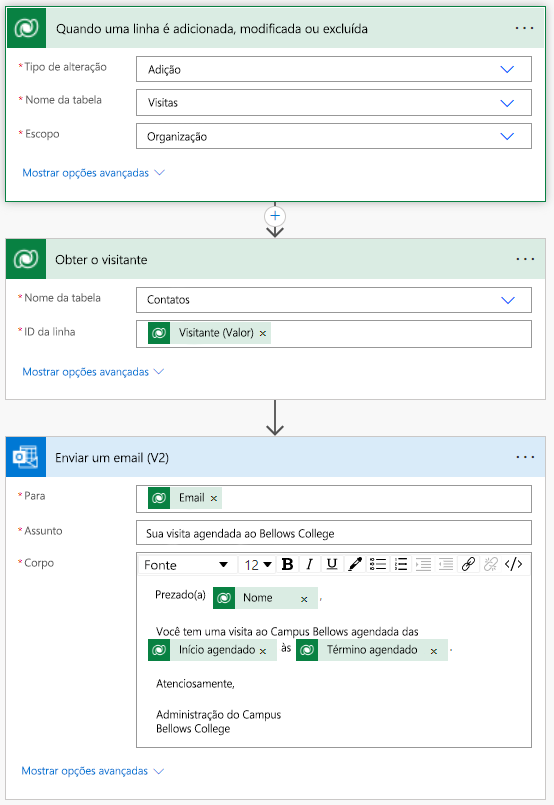

---
lab:
  title: '‘Laboratório 4: Saiba como construir uma solução automatizada'
  module: 'Module 4: Get Started with Power Automate'
ms.openlocfilehash: 35d4b6940f31e1a2aef5e8b43d8ca7007e1b72f2
ms.sourcegitcommit: 8a89b7eacd1a65eaa7c5d6bff0dc7254991c4dde
ms.translationtype: HT
ms.contentlocale: pt-BR
ms.lasthandoff: 07/15/2022
ms.locfileid: "147154318"
---
# ‘Laboratório 4: Saiba como construir uma solução automatizada

## Cenário

O Bellows College é uma organização educacional que possui um campus com vários edifícios. Atualmente as visitas ao campus são anotadas em papel. As informações não são coletadas de forma consistente e não há meios de analisar os dados sobre as visitas em todo o campus.

A administração do campus quer modernizar o sistema de registro de visitantes, com controle do acesso aos edifícios pelo pessoal de segurança, além de exigência de notificação prévia e registro de todas as visitas pelos anfitriões.

Ao longo deste curso, você vai criar aplicativos e fazer automações para permitir que a administração e a equipe de segurança do Bellows College gerenciem e controlem o acesso aos edifícios no campus.

Neste laboratório, você criará um fluxo do Power Automate para enviar um email a um visitante quando uma visita for agendada.

## Macroetapas do laboratório

Os pré-requisitos seguintes foram identificados para que o projeto seja concluído:

- Os contatos precisam ser notificados por email quando uma visita for agendada.

## Pré-requisitos

- Conclusão do **Módulo 0 Laboratório 0 - Validação do ambiente de laboratório**
- Conclusão do **Laboratório 1 do Módulo 2 – Modelagem de Dados**
- Conclusão do **Laboratório 3 do Módulo 2 – Como criar um aplicativo controlado por modelo**
- Contato de Davi Barros criado com um endereço de email pessoal preenchido

## Exercício 1: Criar fluxo de Notificação de visita

**Objetivo:** Neste exercício será criado um fluxo no Power Automate que implementa o requisito. O visitante deve receber um email incluindo o código exclusivo atribuído à visita quando ela é criada.

### Tarefa \#1: Criar um fluxo

1.  Navegue até <https://make.powerapps.com>. Talvez seja necessário reautenticar - clique em **Entrar** e siga as instruções, se necessário.

2.  No canto superior direito, selecione o ambiente **Prática [minhas iniciais]** se ainda não tiver selecionado.

3.  Na barra de navegação à esquerda, selecione **Fluxos**.

4.  Se solicitado, selecione **Começar**.

5.  Clique em **Novo fluxo** e selecione **Fluxo de nuvem automatizado**.

6.  Insira "Notificação de Visita" em **Nome do fluxo**.

7.  Em **Escolher o gatilho do fluxo**, pesquise por **Dataverse**.

8.  Selecione o gatilho **Quando uma linha for adicionada, modificada ou excluída** e, em seguida, clique em **Criar**.

9.  Preencha as condições de gatilho do fluxo:

    1.  Selecionar **Adicionado** para **Alterar tipo**

    2.  Selecione **Visitas** em **Nome da tabela**

    3.  Selecione **Organização** em **Escopo**

    4.  Na etapa de ativação, clique nas reticências ( **...** ) e clique em **Renomear**. Renomeie esse gatilho **"Quando uma visita é criada"** . Essas ações são importantes para que todos com permissão para editar o fluxo entendam o propósito da etapa sem precisar de maiores detalhes.

### Tarefa \#2: Criar uma etapa para obter a linha de visitantes

1.  Selecione **+ Nova Etapa**. Esta etapa é necessária para recuperar as informações dos visitantes, inclusive o endereço de email.

2.  Pesquise por **Dataverse**.

3.  Selecione a ação **Obter uma linha por ID**.

4.  Selecione **Contatos** em **Nome da tabela**

5.  Selecione o campo **ID da Linha**. Observe que uma janela para selecionar conteúdo dinâmico ou expressões será exibida.

6.  No campo **ID de linha**, selecione **Visitante (Valor)** na Lista de conteúdo dinâmico. Nesta etapa, busque o contato da linha de Visita que foi criada para acionar esse fluxo. Como o endereço de email faz parte da tabela de Contato, você precisará dessas informações para enviar o email ao visitante.

7.  Neste momento, clique nas reticências ( **...** ) e clique em **Renomear**.
        Renomeie esta ação **"Criar visitante"** . Essas ações são importantes para que todos com permissão para editar o fluxo entendam o propósito da etapa sem precisar de maiores detalhes.

### Tarefa \#3: Criar uma etapa para enviar um email ao visitante

1.  Clique em **+ Nova etapa**. É nessa a etapa que um email será enviado para o visitante.

2.  Pesquise por *email*, selecione o conector do **Office 365 Outlook** e a ação **Enviar um email (V2)** .

3.  Se precisar aceitar termos e condições para usar esta ação, clique em **Aceitar**.

4.  Selecione **Adicionar conteúdo dinâmico** no campo **Para**. 
    
5.  Selecione **Email** na lista de conteúdo dinâmico.
        > Notice that it is beneath the **Get the visitor** header. This means you
        are selecting the Email that is related to the Visitor that you looked
        up in the previous step.

6.  Insira **Sua visita agendada ao Bellows College** no campo **Assunto**.

7.  Insira o seguinte texto no **Corpo do email**:

>   O conteúdo dinâmico precisa ser inserido onde os campos são nomeados entre colchetes. É recomendado copiar e colar todo o texto primeiro e, em seguida, adicionar o conteúdo dinâmico nos locais corretos.

~~~~~~~~~~~~~~~~~~~~~~~~~~~~~~~~~~~~~~~~~~~~~~~~~~~~~~~~~~~~~~~~~~~~~~~~~~~~~~~~
   Dear {First Name},

   You are currently scheduled to visit Bellows Campus from {Scheduled Start} until {Scheduled End}.

   Best regards,

   Campus Administration
   Bellows College
~~~~~~~~~~~~~~~~~~~~~~~~~~~~~~~~~~~~~~~~~~~~~~~~~~~~~~~~~~~~~~~~~~~~~~~~~~~~~~~~

8.  Realce o texto **{First Name}** . Substitua-o pelo campo **Nome** da etapa **Obter o visitante**.

9.  Realce o texto **{Scheduled Start}** . Substitua-o pelo campo **Início do agendamento** na etapa **Quando a visita será adicionada**.

10.  Realce o texto **{Scheduled End}** . Substitua-o pelo campo **Final do agendamento** na etapa **Quando uma visita será adicionada**.

11.  Clique em **Salvar**.

Deixe esta guia de fluxo aberta para a próxima tarefa. Seu fluxo deve ser parecido com o seguinte:

### Tarefa \#4: Validar e testar o fluxo

1.  Abra uma nova guia no navegador e navegue para <https://make.powerapps.com>.

2.  No canto superior direito, selecione o ambiente **Prática [minhas iniciais]** se ainda não tiver selecionado.

3.  Clique em **Aplicativos** e selecione o aplicativo baseado em modelo **Administração de campus Bellows** criado anteriormente.

3.  Deixando essa guia do navegador aberta, navegue de volta para a guia anterior de seu fluxo.

4.  Na barra de comandos, clique em **Testar**. Selecione **Manualmente** e clique em **Testar**.

5.  Navegue até a guia do navegador com seu aplicativo baseado em modelo aberto. 

6.  Usando a navegação à esquerda, selecione **Visitas**

6. Pressione o botão **+ Novo** para adicionar um novo registro de **Visita**.

7. Preencha o registro da Visita da seguinte forma:

    -   **Nome:** Visit de teste

    -   **Visitante:** John Doe

    -   **Início agendado:** Amanhã às 8h

    -   **Término agendado:** Amanhã às 9h

8. Selecione o botão **Salvar e Fechar (Save and Close)** .

9. Navegue até a guia do navegador com o fluxo de teste em execução. Após um momento, você deverá ver o fluxo em execução. É aqui que você pode detectar quaisquer problemas no fluxo ou confirmar se ele foi executado com êxito.

Após um pequeno atraso, você deverá ver um email em sua caixa de entrada, uma vez que preencheu o email de John Doe com seu email pessoal. Observe que ele pode ir para sua pasta de lixo eletrônico.

## Desafios

- Brincar com a formatação no email. Como você pode torná-lo mais profissional?