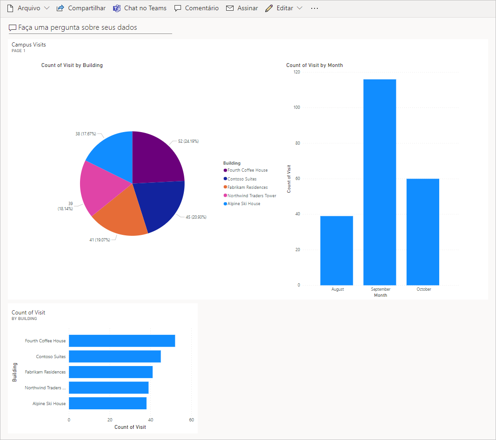

---
lab:
    title: 'Laboratório 7: Como criar um painel simples'
    module: 'Módulo 5: Introdução ao Power BI'
---

# Módulo 5: Introdução ao Power BI
## Laboratório: Como criar um painel simples

# Cenário

O Bellows College é uma instituição educacional com vários edifícios no campus. Atualmente as visitas ao campus são anotadas em papel. O registro das informações não é consistente e não existe nenhum recurso para coletar e analisar os dados das visitas em todo o campus. 

A administração do campus quer modernizar o sistema de registro de visitantes, com controle do acesso aos edifícios pelo pessoal de segurança, além de exigência de notificação prévia e registro de todas as visitas pelos anfitriões.

Ao longo deste curso, você vai criar aplicativos e fazer automações para permitir que a administração e a equipe de segurança do Bellows College gerenciem e controlem o acesso aos edifícios no campus. 

Neste laboratório você vai criar um painel do Power BI que mostra dados sobre as visitas ao campus.

# Macroetapas do laboratório

Vamos seguir as etapas abaixo para projetar e criar o painel do Power BI:

-   Conectar ao Dataverse
-   Alterar os dados para incluir descrições amigáveis nas linhas relacionadas (pesquisas)
-   Criar e publicar um relatório com várias visualizações das informações de visitas ao campus
-   Usar uma linguagem de consulta natural ao usuário para criar visualizações adicionais
-   Criar uma visão do painel do Power BI para dispositivos móveis


## Pré-requisitos

* Conclusão do **Módulo 0 Laboratório 0 – Validar ambiente do laboratório**
* Conclusão do **Módulo 2 Laboratório 1 – Introdução ao Microsoft Dataverse**

## Questões importantes antes de prosseguir

-   Quem é o público-alvo do relatório?
-   Como o público-alvo usará o relatório? Qual é o dispositivo usual? Qual é o local?
-   Existem dados suficientes para visualizar o painel?
-   Quais são as características que você pode usar para analisar os dados sobre as visitas?

# Exercício 1: criar um relatório do Power BI 

**Objetivo:** Neste exercício você vai criar um relatório do Power BI com base nos dados do seu banco de dados Dataverse.

## Tarefa 1: instalar o Power BI Desktop/preparar o serviço do Power BI

1. Siga as instruções abaixo para configurar o Power BI: 

    - Se o Power BI Desktop **já** está instalado, prossiga para a [Tarefa 2](#task-2-prepare-data).
    
    - Se você ainda não instalou o Power BI Desktop, conclua a **Etapa 2**.
    
    - Se você não tem as permissões necessárias ou não consegue executar o Power BI Desktop, prossiga para a **Etapa 4**.

2. Acesse [https://aka.ms/pbidesktopstore](https://aka.ms/pbidesktopstore) para baixar e instalar o Power BI Desktop.

    > [!IMPORTANTE]
    > Se você não conseguir instalar o Power BI Desktop usando o Microsoft Store, tente o instalador autônomo que pode ser baixado em [https://aka.ms/pbiSingleInstaller](https://aka.ms/pbiSingleInstaller).

3. Se você conseguiu instalar o Power BI Desktop, vá para a [Tarefa 2](#task-2-prepare-data); caso contrário, execute para a próxima etapa.

    > Se você não tiver as permissões necessárias para instalar aplicativos para desktop ou tiver dificuldades para executar ou configurar o Power BI Desktop, conclua as etapas da tarefa abaixo.

4. Baixe o [visits.pbix](../../Allfiles/visits.pbix) e salve no computador.

5. Acesse [https://app.powerbi.com/](https://app.powerbi.com/) e clique em **Entrar**. 

6. Clique em **Meu espaço de trabalho**. 

7. Se a página **Obter dados** é exibida, clique em **Ignorar**. 

8. Expanda **+Novo** e selecione **Fazer upload de arquivo**.

    > [!IMPORTANTE]
    > Se você não encontrar **+Novo**, ative a nova aparência do Power BI. Confira se você alterou a opção **Nova aparência** para **Ativado** no topo da tela.

9. Selecione **Arquivo local**.

10. Localize e selecione o arquivo **visits.pbix** que você baixou anteriormente.

11. Depois de carregar os dados, selecione o relatório **visitas** (observe que Tipo está definido como **Relatório**).

12. Clique em **Editar**. Se o item de menu **Editar** não estiver visível, clique em **...** e selecione **Editar**.

13. Você concluiu a configuração do serviço do Power BI para usar em seus laboratórios. Prossiga para a [Tarefa 3](#task-3-create-chart-and-time-visualizations), mas use o serviço online do Power BI em [https://app.powerbi.com](https://app.powerbi.com) em vez do Power BI Desktop para todo o laboratório.

## Tarefa 2: preparar os dados

1.  Encontre o URL de sua empresa.

    * Abra uma guia nova e acesse o Centro de administração do Power Platform em <https://admin.powerplatform.com>.
    
    * Na página de navegação à esquerda, selecione Ambientes e abra seu ambiente de Prática.
    
    * Clique com o botão direito do mouse em **URL do ambiente** no painel **Detalhes** e selecione **Copiar link do endereço**.
    
2. Abra o Power BI Desktop e entre com suas credenciais quando solicitado.

3. Selecione **Obter dados** e selecione **mais...**.

4. Selecione **Power Platform** à esquerda, depois selecione **Common Data Service (herdado)** e pressione **Conectar**. Se for solicitado, entre com as credenciais fornecidas e clique em **Conectar**.

5. Cole o URL do ambiente que você copiou anteriormente dentro do campo **URL do servidor** e pressione **OK**.

6. Expanda o nó **Entidades**, selecione as entidades **bc_Building** e **bc_Visit** e clique em **Carregar**.

7. Clique no ícone **Modelo** na barra de ferramentas vertical, à esquerda.

8. Arraste a coluna **bc_buildingid** da tabela **bc_Building** e solte na coluna **bc_building** na tabela **bc_Visit**. Isso cria um relacionamento entre as duas tabelas usadas pelo Power BI para exibir dados relacionados.

9. Selecione o ícone **Relatório** na barra de ferramentas vertical.

10. Expanda o nó **bc_Visit** do painel **Campos**.

11. Clique em **...** ao lado do **bc_Visit** e selecione **Nova coluna**.

12. Preencha a fórmula da seguinte forma:

    ```
    Column = RELATED(bc_Building[bc_name])
    ```

    e pressione ENTER. Isso adiciona um novo campo com o nome do prédio aos dados das visitas.

13. Clique em **...** ao lado do campo **Coluna** que você acabou de criar e selecione **Renomear**. Digite **Prédio** como o nome do campo.

14. Clique em **...** ao lado do campo **bc_visitid** e selecione **Renomear**. Digite **Visita** como o nome do campo.

15. Clique em **...** ao lado do campo **bc_scheduledstart** e selecione **Renomear**. Digite **Início** como o nome do campo.

16. Para salvar o trabalho em andamento, clique em **Arquivo \| Salvar** e escolha um nome para o arquivo.

## Tarefa 3: criar gráficos e visualizações de tempo

1. Pressione o ícone de pizza no painel **Visualizações** para inserir um gráfico.

2. Arraste o campo **Prédio** e solte dentro da caixa **Legenda**.

3. Arraste o campo **Visita** e solte dentro da caixa **Valores**.

4. Redimensione o gráfico de pizza usando as alças de canto para que todos os componentes do gráfico fiquem visíveis.

5. Clique fora do gráfico de pizza para desmarcá-lo e selecione o gráfico de colunas no painel **Visualizações**. 

6. Arraste o campo **Visita** e solte dentro da caixa **Valores**.

7. Arraste o campo **Início** e solte dentro da caixa **Eixo**.

8. No painel Visualizações, clique em **x**, ao lado de **Dia** e **Trimestre**, para deixar somente os totais de **Ano** e **Mês** no Eixo.

9. Redimensione o gráfico conforme desejado usando as alças de canto.

10. Teste a interatividade do relatório:

    * Selecione várias partes do gráfico de pizza dos prédios e observe as mudanças no relatório de tempo.
    
    * Clique no gráfico de colunas. Pressione a seta para baixo para ativar o modo **Drill down** e pressione a coluna para detalhar o próximo nível (meses). Outra forma de fazer isso é clicar em **Dados/Drill \| Expandir próximo nível** na faixa de opções.
    
    * Faça pesquisas detalhadas ou agrupadas e selecione várias barras no gráfico de colunas de tempo para observar as mudanças no relatório de pizza.
    
11. Para salvar o trabalho em andamento, clique em **Arquivo \| Salvar**.

# Exercício 2: criar um painel do Power BI

## Tarefa 1: publicar um relatório do Power BI

1. Pressione o botão **Publicar** na guia Início da faixa de opões.

2. Selecione **Meu espaço de trabalho** como destino, e depois pressione **Selecionar**.

3. Espere a conclusão da publicação e clique em **Abrir \<nome do relatório\>.pbix no Power BI**.

## Tarefa 2: criar um painel do Power BI

1. Abra o relatório criado na tarefa anterior.

2. Selecione **Fixar no painel** no menu. Dependendo do layout, você precisa pressionar **...** para exibir os itens de menu adicionais.

3. Selecione **Novo painel** na janela de prompt **Fixar no painel**.

4. Digite **Gerenciamento do campus [Seu sobrenome]** como o **Nome do painel**, pressione **Fixar dinâmico**.

5. Selecione **Meu espaço de trabalho** no topo, depois selecione o painel **Gerenciamento do campus [Seu sobrenome]**.

6. Teste a interatividade dos gráficos de pizza e barras exibidos.

## Tarefa 3: adicionar visualizações usando linguagem natural

1. No painel **Gerenciamento do campus**, selecione a barra **Faça uma pergunta sobre os dados** no topo.

2. Digite **prédios por número de visitas** na área de P e R (Perguntas e Respostas) O gráfico de colunas é exibido.

3. Selecione **Fixar visual**.

4. Selecione **Painel existente**, selecione o painel **Gerenciamento do campus [Seu sobrenome]** e pressione **Fixar**.

5. Clique em **Sair de P e R**.

O painel **[Gerenciamento do campus [Seu sobrenome]** é exibido. Role a tela para baixo para ver o novo visual de P e R. 

Seu painel deve se parecer com o seguinte:



## Tarefa 4: criar uma visualização para celular e compartilhar um relatório com código QR

1. No painel, selecione **Editar \| Visualização para dispositivos móveis**.

2. Reorganize os blocos conforme desejado.

3. Clique em **Visualização para celular** na parte superior direita e altere a Visualização para **Visualização para Web**.

4. Selecione **Meu espaço de trabalho** na parte superior direita e selecione seu **Relatório**.

5. Selecione **Editar** e depois selecione **... \| Gerar o Código QR**.

6. *Opcional:* Se você tiver um dispositivo móvel, digitalize o código usando um aplicativo de scanner QR disponível para as plataformas iOS e Android, ou um aplicativo de câmera se o seu telefone for compatível. Faça login na sua conta quando solicitado. Navegue e explore o relatório no dispositivo móvel

# Desafios

* Crie painéis e relatórios para incluir as plantas de construção do campus e dos prédios
* Crie relatório e analise padrões e tendências das visitas
* Explore as visualizações
* Faça streaming do Power BI para processamento quase em tempo real para um grande campus 
