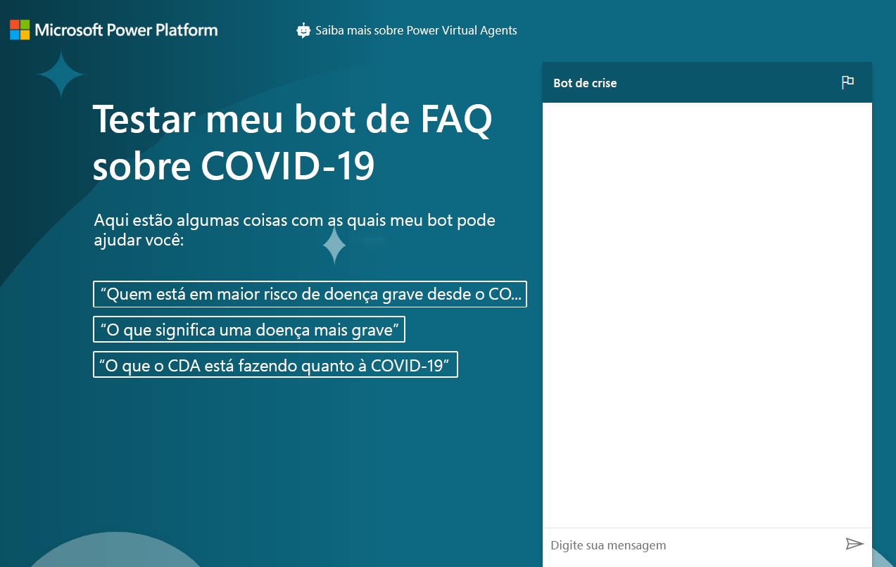

---
lab:
    title: 'Laboratório 8: Como criar um chatbot básico'
    module: 'Módulo 6: Introdução ao Power Virtual Agents'
---

# Módulo 6: Introdução ao Power Virtual Agents
## Laboratório: Como criar um chatbot básico

# Cenário

O Bellows College é uma organização educacional que possui um campus com vários edifícios. Atualmente, as visitas ao campus são registradas em diários de papel. As informações não são coletadas de forma consistente e não há meios de analisar os dados sobre as visitas em todo o campus.

Como a maioria das organizações, o Bellows College está atuando rapidamente contra a desinformação acerca da COVID-19, ratificando práticas recomendadas e cronogramas, dentre outras medidas. Neste laboratório será criado um chatbot do Power Virtual Agent que redirecionará à página do Center for Disease Control (CDC) com perguntas e respostas sobre o status atual da pandemia. Essa configuração é interessante para a faculdade, que pode incorporá-la ao seu site de portal, bem como disponibilizá-la ad hoc à medida que os departamentos forem reabrindo conforme o planejamento.

## Etapas gerais

Seguiremos as estruturas de tópicos abaixo para construir nosso Power Virtual Agent:

  - Inscreva-se para obter uma versão de avaliação do Power Virtual Agent

  - Construa um bot usando as FAQs

  - Teste o bot

  - Mude a saudação padrão

  - Publique o bot

  - **Desafio extra:** Incorporar o bot em seu portal

## Pré-requisitos

Os pré-requisitos seguintes foram identificados para que o projeto seja concluído:

  - Conclusão do **Módulo 0 Laboratório 0 - Validação do ambiente de laboratório**

  - Conclusão do **Módulo 2 Laboratório 1 - Introdução ao Microsoft Dataverse**

  - Apenas exercícios bônus: Conclusão do **Módulo 6 Laboratório 4 - Introdução aos portais do Power Apps** 

## Considerações antes de começar

Os bots podem ser muito úteis em diversas situações. Com base no que você sabe até agora sobre o Bellows College, pense onde mais um bot poderia ser útil no campus.

# Exercício \#1: Inscrever-se no PVA e Criar um novo bot

Neste exercício, você se inscreverá para obter uma versão de avaliação do Power Virtual Agents.

1.  Acesse o [Power Virtual Agents](https://powerva.microsoft.com/)

2.  Clique em **Iniciar Avaliação Gratuita**.

3.  Inicie uma sessão, caso seja solicitado.

4. A janela **Criar novo bot** deverá aparecer.

5. Insira **Bot de Crise** como **Nome** e selecione o idioma.

6. Selecione seu ambiente de Prática para criar o bot e clique em **Criar**. Aguarde até que o bot seja criado. Clique em **Explorar bot** caso seja solicitado.

7. Teste o bot. Digite **Olá** na caixa de mensagem e clique em **Enviar**. O bot deve cumprimentá-lo e informá-lo sobre o que ele pode fazer.

8. Feche o **Chat**.

9. Selecione **Tópicos**. O bot vem com algumas amostras de tópicos de usuários e alguns tópicos de sistema. A saudação padrão vem dos tópicos de sistema.

> No próximo exercício, você vai gerar seus próprios tópicos a partir do site de FAQ do CDC. Não saia desta janela do navegador.

# Exercício \#2: Criar tópicos

Neste exercício, você vai gerar seus próprios tópicos a partir do site de FAQ do CDC.

1.  Na nova aba, acesse o site [CDC FAQ](https://www.cdc.gov/coronavirus/2019-ncov/faq.html) e examine seu conteúdo. Você vai gerar seus tópicos a partir dessas FAQs.

2.  Copie o URL.

3.  Volte para o Power Virtual Agents e verifique se **Tópicos** ainda está selecionado.

4.  Selecione a aba **Sugestão** abaixo de **Tópicos**.

5.  Clique em **Iniciar.**

6. Cole o URL que você copiou na caixa de texto **Link para conteúdo online** e clique em **Adicionar**. Se você copiou a URL completa, https:// estará listado duas vezes. Certifique-se de que o URL liste o protocolo apenas uma vez.

7.  Clique em **Iniciar** e aguarde. Isso pode levar alguns minutos.

8.  Você deve criar alguns tópicos de sugestão. Clique para abrir um dos tópicos sugeridos.

9. A resposta do bot para cada frase de gatilho deve estar disponível. **Clique em Adicionar aos tópicos.**
    
10. O tópico sugerido deve ser adicionado aos seus tópicos. Selecione todos os tópicos sugeridos e clique em **Adicionar aos tópicos** 

    > Você pode selecionar todos os tópicos usando o ícone à esquerda da coluna Nome. Se você receber uma mensagem de erro, tente novamente.

11. Assim que os tópicos sugeridos forem adicionados, selecione a aba **Existente**. Você deve ver os novos tópicos com o status definido como Desativado.

12. Use o botão de alternância na coluna **Status** para mudá-lo para **Ativado**. 

13. Anote a frase de gatilho para um dos tópicos que você ativou para que você possa testá-lo mais tarde.

> Não saia desta janela do navegador.

# Exercício \#3: Testar tópicos

Nesta tarefa, você testará os tópicos que adicionou.

1.  Clique em **Teste o bot** no canto inferior esquerdo.

2.  Clique em **Redefinir**.

3.  Digite a frase de gatilho que você copiou na tarefa anterior e clique em **Enviar**.

4.  O bot deve fornecer as informações corretas e perguntar se respondeu satisfatoriamente à sua pergunta. Clique em **Sim**.

5.  O bot solicitará uma avaliação de seu desempenho. Dê uma excelente nota.

6.  O bot deve perguntar se pode ajudá-lo com mais alguma coisa. Clique em **Não, obrigado**.

7.  O bot deve encerrar a sessão de bate-papo.

8.  Digite **olá** e clique em **Enviar**.

9.  O bot deve cumprimentá-lo e informá-lo sobre o que ele pode fazer. Seu bot agora pode ajudar os usuários com as perguntas frequentes sobre a COVID-19, então será necessário alterar a mensagem de saudação na próxima tarefa. Não saia desta janela do navegador.

# Exercício \#4: Alterar a saudação

Nesta tarefa, você irá alterar a saudação específica para COVID-19.

1.  Verifique se **Tópicos** está selecionado e escolha a guia **Existente**.

2.  Recolha a seção **Tópicos de Usuário**.

3.  Clique para abrir o tópico **Saudação** de Tópicos do Sistema. A caixa de pesquisa também pode ser usada para **Pesquisar tópicos existentes**.

4.  O tópico de saudação tem 52 frases de gatilho, clique em **Ir para a tela de autoria**.

5.  Vá para a primeira mensagem e substitua por `Hi, I’m a virtual agent. I can tell you about how COVID-19 spreads, how to protect yourself, preparing your home and family for COVID-19, symptoms, testing, and more.`

6.  Clique em **Salvar**.

7.  Clique em **Testar Bot** se o bot não estiver aberto. Clique em **Reiniciar** para reiniciar o chat.

8.  Digite olá e clique em **Enviar**.

9.  O bot agora deve responder com a nova saudação.

# Exercício \#5: Publicar o bot

Neste exercício, você publicará o bot.

1.  No painel de navegação esquerdo, selecione **Publicar**.

2.  Clique em **Publicar**.

3.  Clique em **Publicar** novamente e aguarde a conclusão da publicação.

4.  Expanda **Gerenciar** na barra de navegação esquerda e selecione **Canais**.

5.  Você receberá uma lista de canais disponíveis nos quais você pode publicar o bot. Selecione **Site de demonstração**.

6.  Altere a mensagem de boas-vindas para `Try my COVID-19 FAQ bot`.

7.  Insira o seguinte **Iniciador de conversa**:
    ```
     “Who is at higher risk for serious illness from COVID-19”
     “What does more severe illness mean”
     “What is the CDC doing about COVID-19”
    ```
    
8.  Clique em **Salvar**.

9.  Copie o **URL**.

> O URL pode ser compartilhado com seus colegas para obter o feedback deles. 

10.  Abra uma nova janela do navegador ou guia e acesse o URL que você copiou. O site de demonstração deve ser similar ao da imagem abaixo.

11. Vá em frente e comece a conversar com o bot.  
    
Quando concluído, seu bot publicado deve ser semelhante a este:



# Desafios 
* Incorpore seu chatbot ao seu portal de visitantes do Bellows College (mais informações sobre como fazer isso em **Adicionar bot ao Power Apps** [aqui](https://docs.microsoft.com/pt-br/power-virtual-agents/publication-connect-bot-to-web-channels).)
